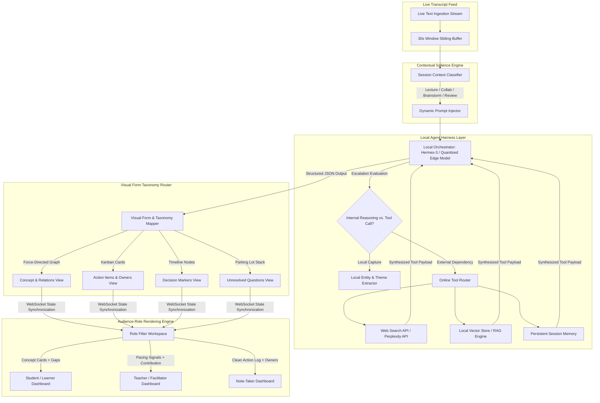

# **SynapseRT: Context-Aware Real-Time Salience Pipeline, Offline Agent Harness Engine, and Multi-View Visual Orchestration Framework for Collaborative Environments**

*A comprehensive technical specification, architectural blueprint, and panel defense preparation guide for the BSIT Capstone Title Defense.*

---

## **1. Title Defense Alignment & Structural Overview**

### **The Core Shift**
Unlike conventional transcription apps that passively dump raw text archives, SynapseRT operates entirely within the layer between raw transcript ingestion and rendered collaborative output. It solves the problem of information overload in high-density collaborative or learning sessions by acting as a **Contextual Salience Engine**.

$$\text{SynapseRT} = \underbrace{\text{Session Context Classification}}_{\text{Information Diet Mode}} + \underbrace{\text{Local Agent Harness Layer}}_{\text{Orchestration \& Tool Escalation}} + \underbrace{\text{Audience Role Rendering}}_{\text{Visual Taxonomy Layer}}$$

### **System Target Metrics**
* **Context Classification Precision**: $\ge90\%$ on 30-second text streaming frames.
* **Visual Form Assignment Accuracy**: $\ge85\%$ F1-Score matching human facilitator intents.
* **Agent Harness Latency**: $<1.5\text{s}$ tool invocation overhead.
* **UI Frame Synchronization**: $<100\text{ms}$ over state-synchronized WebSockets.

---

## **2. Deep-Dive: 8-Section Defense Pacing (5-Minute Budget)**

### **Section 1 — The Title (15 Seconds)**
> **Slide 1: Formal Title & Registry**
> * **Title**: *SynapseRT: Context-Aware Real-Time Salience Pipeline, Offline Agent Harness Engine, and Multi-View Visual Orchestration Framework for Collaborative Environments*
> * **Registry Code**: BSIT-CAP2-2026-SRT-V2
> * **Verbal Lead**: *"Good morning, members of the panel. We present SynapseRT, a system that moves beyond passive meeting archiving to investigate a real-time semantic salience pipeline. It processes live speech streams, classifies the session context, and orchestrates an offline local LLM agent to inject online tools and dynamic visual artifacts into the room's workspace without breaking collaborative flow."*

### **Section 2 — The Scene (30 Seconds)**
> **Slide 2: The Chaos of Information Overload**
> * **Visual**: Raw text wall transcript vs. a fluid dashboard transforming instantly based on who is viewing it (Student vs. Teacher vs. Note-taker).
> * **The Hook**: *"During high-density learning or planning sessions, the problem is no longer capturing text—it is cognitive overload. Raw transcripts are a wall of noise. A student needs concise concept maps, a teacher needs pacing signals, and a project manager needs Kanban tasks. SynapseRT reads between the lines, identifying what matters, who needs to see it, and what visual form best communicates it in real time."*

### **Section 3 — The Problem (45 Seconds)**
The proposed system addresses three distinct computer science and UX limitations:
1.  **Context-Blind Data Dumps**: Traditional text capture systems treat a lecture, a review session, and a corporate sprint planning exactly the same, generating unstructured logs that ignore the unique "information diet" of the room.
2.  **The API Isolation Dilemma**: Cloud-based transcription apps require users to leave the meeting interface to lookup terms, fetch external data, or check persistent memory, shattering cognitive presence.
3.  **Monolithic UI Inflexibility**: Standard collaborative boards display an identical view to all participants, failing to tailor visual syntax to the specific role and needs of the user looking at the screen.

### **Section 4 — The Proposed System & Architecture (60 Seconds)**



### **Section 5 — Component Coverage Map (45 Seconds)**

| Component | Technology Stack | Implementation Role in SynapseRT | Falsifiable Verification Metric |
| --- | --- | --- | --- |
| **Web App** | SvelteKit, TailwindCSS, WebSockets | Multi-view synchronized client workspaces rendering role-filtered visual widgets simultaneously. | State-sync payload render latency $<100\text{ms}$ across separate client nodes. |
| **Mobile App** | Flutter | Facilitator's HUD and ambient input controller showing contribution gaps and pacing alerts. | Pacing alert push execution delay $<250\text{ms}$ upon trigger. |
| **Agent Engine** | Hermes-3-7B / OpenClaw Framework via Ollama | Edge orchestration engine executing local structural reasoning, tool evaluation, and function-calling JSON emission. | Success rate of selective tool escalation over arbitrary noise $\ge92\%$. |
| **Salience Pipeline** | Python FastText / Lightweight BERT Embeddings | Real-time token block classification to detect session mode shifting on the fly. | F1-Score of context classification $\ge90\%$ on live evaluation datasets. |
| **Visual Taxonomy** | D3.js, Chart.js, HTML Canvas components | Generates and scales the 7 core visual formats (Graphs, Swimlanes, Kanban, Timelines, Parking Lots). | Code engine accurately matches taxonomy criteria $\ge85\%$ against human annotation. |

### **Section 6 — The Novelty Claim (30 Seconds)**

**Slide 5: The Agent Harness Innovation**
* **The Claim**: SynapseRT shifts focus from simple offline capture to an edge-native orchestration harness. It features a local orchestrating model that selects, invokes, and synthesizes online tools in real-time, injecting structured knowledge artifacts directly into a multi-role visual interface.
* **Contrast Table**:

| Feature | Passive Archivers (Otter / Zoom AI) | SynapseRT (Ours) |
| --- | --- | --- |
| **Processing Paradigm** | Passive linear text logs | **Context-Aware Salience Filtering** |
| **UI Delivery** | Single, monolithic text block output | **Dynamic Taxonomy Router (7+ Formats)** |
| **Interface Scope** | One-size-fits-all view for the room | **Audience Role Rendering (Student/Teacher/PM)** |
| **Tool Execution** | No active querying capability | **Local Agent Harness with Online Escalation** |

### **Section 7 — Scope & Boundaries (30 Seconds)**

**In-Scope**:
- Dynamic session mode classification across 4 key formats (Lecture, Collaboration, Brainstorm, Review).
- Role-aware UI rendering generating unique client interfaces from a unified application state.
- Local agent function-calling loops invoking up to 3 distinct online tools (Web Search, RAG DB, Session Memory).
- Real-time generation of the 7 taxonomy-mapped visual components.

**Out-of-Scope**:
- Custom development of proprietary foundational LLMs (we rely entirely on open-weight edge models).
- Hardware-level microphone DSP optimization (audio stream ingestion is assumed via standard IP mics or optional client device inputs).
- Automated legal drafting or enterprise authentication suites.

### **Section 8 — Technical Risks & Roadmap (45 Seconds)**

**Slide 7: Technical Obstacles & Roadmap**
* **Hardest Technical Obstacles**:
1. *Context Drift & Flashing UIs*: Rapid dialogue can cause erratic visual form shifting. We mitigate this by introducing a sliding temporal stabilization window ($t=30\text{s}$) before switching UI states.
2. *Function-Calling Latency on the Edge*: Local models can lag during tool orchestration. Optimized INT4/INT8 quantization and asynchronous payload streaming are required to meet the $<1.5\text{s}$ response target.

**Roadmap**:
*Phase 1 (M1-M3)*: Salience classifier design, prompt engineering matrices, and visual form taxonomy logic setup.
*Phase 2 (M4-M6)*: Local agent harness construction, function-calling orchestration layer, and online tool integration.
*Phase 3 (M7-M9)*: SvelteKit multi-role layout assembly, WebSocket state synchronization, and live context experiment runs.

**Complexity Rating**: High Conceptual & System Complexity / High Feasibility.

---

## **3. Deep Engineering Specifications**

### **3.1 The Contextual Salience Logic**

The system processes continuous tokens from the live speech feed. A sliding window vector aggregator groups utterances into text chunks $U_t$. The **Session Context Classifier** running locally assigns a probability vector across the defined workspace modes:

$$\mathbf{P}_{\text{mode}} = \text{Softmax}(\mathbf{W} \cdot \mathbf{E}(U_t) + \mathbf{b})$$

Where $\mathbf{E}(U_t)$ represents the text embedding vector. The dominant mode determines the information filter schema:

- [Lecture Mode]        --> Prioritize: Concepts, Definitions, Knowledge Gaps
- [Collaboration Mode]  --> Prioritize: Action Items, Ownership Assignments, Decisions
- [Brainstorm Mode]     --> Prioritize: Themes, Idea Clusters, Recurrent Threads
- [Review Mode]         --> Prioritize: Critiques, Affirmed Points, Deferred Items

### **3.2 Visual Form Taxonomy Routing Matrix**

The system maps the unstructured agent payload to specific interface layouts based on a strict deterministic taxonomy. Let $I_{\text{type}}$ be the identified data structure returned by the agent:

| Extracted Information Type ($I_{\text{type}}$) | Visual Form | Interactive Component Architecture |
| --- | --- | --- |
| **Concept + Relationships** | Force-directed node graph | D3.js active relational vector mapping |
| **Sequential process / Steps** | Flowchart or Swimlane | Dynamic canvas pipeline rendering |
| **Action Items + Owners** | Kanban-style cards | Draggable Kanban boards with status bindings |
| **Decisions Made** | Timeline with markers | Chronological linear vector track |
| **Unresolved Questions** | Parking lot card stack | Stacked card layer component |
| **Key Definitions / Terms** | Floating glossary cards | Contextual inline lookup overlays |
| **Speaker Contribution Balance** | Ambient peripheral indicator | Radial tracking metadata graph |

### **3.3 Agent Harness Layer & Escalation Logic**

The local orchestrator (Hermes-3) runs on a local network node. It analyzes text blocks using JSON function-calling frames. The execution pipeline handles escalation based on structural semantics:

```
                  [Live Transcribed Utterance Input]
                                  |
                                  v
                    { Local Structural Parsing }
                                  |
            +---------------------+---------------------+
            |                                           |
    [Structural Matches]                       [External Inquiries]
            |                                           |
            v                                           v
  { Local Entity Capture }                     { Online Tool Escalation }
  (Direct State Integration)                            |
                                      +-----------------+-----------------+
                                      |                 |                 |
                                      v                 v                 v
                                 [Web Search]       [Local RAG]     [Session Memory]
                                 (Perplexity API)   (Vector DB)    (Historical Logs)
                                      |                 |                 |
                                      +-----------------+-----------------+
                                                        |
                                                        v
                                         { Agent Synthesis Engine }
                                                        |
                                                        v
                                        (Dynamic Workspace UI Insertion)
```

#### **Harness Functional Execution Schema Example (Ollama JSON Call)**

```json
{
  "name": "escalate_tool",
  "arguments": {
    "intent": "definition_lookup",
    "query": "REST API architectural constraints",
    "target_tool": "online_web_search",
    "visual_destination": "floating_glossary"
  }
}
```

---

## **4. Anticipated Panel Defense Q&A**

### **Q1: Why is this an IT/CS research project? Isn't this just a basic dashboard that displays text?**

**The Defense**: *"The research core of SynapseRT lies within the **Contextual Salience Engine and the Visual Form Taxonomy Router**. The scientific problem is determining if an LLM agent, running in a constrained edge harness, can reliably classify live human dialogue patterns into specific session contexts, correctly identify the salience requirement, and map it to an optimal visual taxonomy in real time. We are running an explicit classification and layout experiment—measuring our engine's performance against manual human synthesis to prove system reliability."*

### **Q2: Why use a hybrid approach with a local LLM and online tools? Why not put the entire system on the cloud?**

**The Defense**: *"Deploying the core orchestrator locally guarantees sub-second structural parsing, constant availability, and strict privacy control for the session's baseline data. However, local models lack universal knowledge. The **Agent Harness Layer** acts as an intentional bridge: the local engine retains complete control over when to maintain privacy or save bandwidth, and when to selectively reach out via external APIs for targeted lookup, bringing the answers back to the interface without breaking the user's focus."*

### **Q3: How do you handle UI 'flashing' or chaotic visual updates if the conversation moves too fast or switches topics instantly?**

**The Defense**: *"This is a classic state-synchronization problem. SynapseRT implements a **Sliding Temporal Buffer Layer**. The system does not alter the core visual layout based on a single line of speech. Instead, it aggregates text into 30-second windows and applies a structural decay threshold. A visual layout change (e.g., switching from a Kanban board to a Concept Graph) is only executed when the classification confidence for a new session mode sustains dominance over successive windows, ensuring interface stability."*

### **Q4: How do you measure the accuracy of your 'Audience Role Rendering' engine?**

**The Defense**: *"We measure success across two criteria: **System Latency and Role Relevance**. System latency is checked by running separate client sessions simultaneously and measuring the time delta for updates over WebSockets (target $<100\text{ms}$). Role relevance is validated through user testing experiments. We measure information retrieval speeds across two groups: one using a standard transcript view and another using our role-optimized boards (Learner, Instructor, Note-taker), validating our target of a $50\%$ increase in information retention and retrieval speed."*
