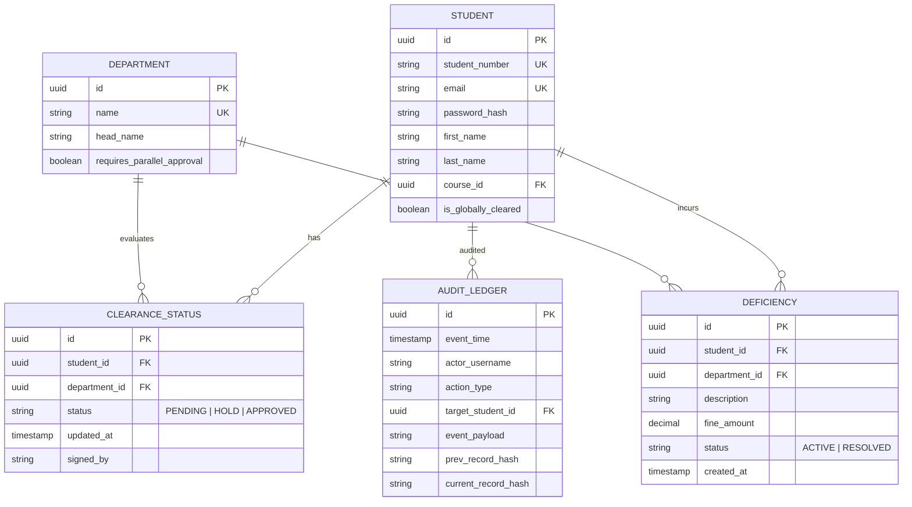

# **Theoretical Foundations and Architectural Design of SwiftClear: A Centralized Institutional Clearance and Workflow Automation Engine**

*A peer-grounded research specification detailing relational workflow state machine integrity, cryptographic non-repudiation logging, Data Privacy Act (RA 10173) compliance, and concurrent queue scalability in higher education institutions.*

---

## **1. Introduction & Contextual Grounding**

In tertiary education institutions, particularly State Universities and Colleges (SUCs) in the Philippines, the end of each academic term triggers a mandatory institutional clearance workflow. Students must secure endorsements from various campus units—the Library, Laboratory, Accounting Office, Dean’s Office, and Registrar—before enrolling for the next semester or receiving official scholastic credentials (diplomas, transcripts).

The traditional paper-based process is characterized by three structural failures:
1.  **Administrative Drag**: Students navigate physical, disconnected offices, leading to high transaction costs (hours spent queuing per office) and geographic congestion across campuses.
2.  **Information Deficit**: Students are unaware of specific department deficiencies (e.g., an unreturned library book or an outstanding laboratory break sheet fee) until they present themselves physically to the clearance officer.
3.  **Audit Disconnections**: The Commission on Audit (COA) requires rigid accounting of institutional clearances to justify final graduation and student status shifts. Paper forms are prone to physical loss, damage, and administrative tampering, lacking a central, verified audit trail.

**SwiftClear** addresses these challenges by moving the clearance state matrix to a centralized digital clearinghouse. This research outlines the engineering foundations required to build such a system with absolute mathematical reliability, data privacy compliance, and strict operational integrity.

---

## **2. Database Schema & Transaction Integrity**

At the core of SwiftClear is a relational schema designed to model parallel and sequential approvals without race conditions. During clearance weeks, the system must process hundreds of concurrent write requests from multiple administrative terminals.

### **Entity-Relationship Model & 3NF Normalization**

The system employs a relational architecture mapped as follows:



### **The Global Lock Condition**

A student's global clearance status ($C_s$) is a calculated logical state. It is marked as `CLEARED` (or `1`) if and only if the sum of all pending or hold statuses across required clearing units is zero:

$$C_s = \prod_{d \in D} \mathbb{I}(\text{Status}_{s, d} = \text{'APPROVED'})$$

Where $D$ is the set of all required departments, and $\mathbb{I}$ is the indicator function. If any single department clearance is `PENDING` or `HOLD`, the global graduation/enrollment clearance remains locked.

### **Transaction Isolation & Race Condition Mitigation**

During clearance periods, a student might resolve a library deficiency at the exact moment the accounting department logs a new outstanding fee. To prevent **dirty reads** or **lost updates** when calculating the global state, SwiftClear enforces a strict transaction isolation level.

We utilize `REPEATABLE READ` or `SERIALIZABLE` transactions inside the database engine during state computations. In SQL, clearance status updates must lock target student rows:

```sql
START TRANSACTION;

-- Select clearance statuses with an exclusive lock on the student's records
SELECT status FROM clearance_status 
WHERE student_id = 'c4d6a89c-4573-4f1b-be88-1a54b9d0342c' 
FOR UPDATE;

-- Update specific department status
UPDATE clearance_status 
SET status = 'APPROVED', updated_at = NOW(), signed_by = 'lib_admin'
WHERE student_id = 'c4d6a89c-4573-4f1b-be88-1a54b9d0342c' 
AND department_id = '88a38c20-ee6f-4029-a1b2-c0e86333cfde';

-- Recalculate global status
SELECT COUNT(*) FROM clearance_status 
WHERE student_id = 'c4d6a89c-4573-4f1b-be88-1a54b9d0342c' 
AND status != 'APPROVED';

-- If count is 0, update student global lock status
UPDATE student 
SET is_globally_cleared = TRUE 
WHERE id = 'c4d6a89c-4573-4f1b-be88-1a54b9d0342c';

COMMIT;
```

By executing `SELECT ... FOR UPDATE`, concurrent transactions attempting to modify the same student's clearance status must wait until the locked transaction completes. This guarantees that the global calculation matches actual row counts.

---

## **3. Security, Cryptographic Auditing, and Non-Repudiation**

A major administrative threat to digital institutional records is **internal unauthorized overrides**—a database administrator or compromised administrative account marking a student "CLEARED" without departmental consent. SwiftClear addresses this via a **Cryptographic Audit Ledger**.

### **Audit Ledger Chaining (Hash-Link Engine)**

Every write operation (clearing a hold, creating a deficiency, overriding a lock) creates an entry in an immutable `AUDIT_LEDGER` table. To prevent retroactive tampering, each record incorporates a cryptographic hash of the current event concatenated with the hash of the preceding record (similar to blockchain block chaining):

$$H_n = \text{SHA-256}(T_n \parallel A_n \parallel E_n \parallel S_n \parallel H_{n-1})$$

Where:
*   $H_n$: Current ledger record hash.
*   $T_n$: Event timestamp.
*   $A_n$: Actor's username (e.g., `librarian_jones`).
*   $E_n$: Action type (e.g., `RESOLVED_LIBRARY_DEFICIENCY`).
*   $S_n$: Target student identifier.
*   $H_{n-1}$: Hash of the previous ledger row ($n-1$).

An automated cron job verifies ledger consistency daily by traversing the hash chain. If a database administrator attempts to manually edit a row in `clearance_status` or delete an audit row, the hash chain breaks, immediately alerting campus security.

```
Record (N-1)                      Record (N)
[Timestamp: 10:14:32]             [Timestamp: 10:15:02]
[Actor: lib_user]                 [Actor: acct_user]
[Prev Hash: ab83...10ff]          [Prev Hash: 9e32...ff01] <-- Holds Hash (N-1)
[Current Hash: 9e32...ff01] ----> [Current Hash: d34b...023e]
```

---

## **4. Data Privacy Compliance (Republic Act No. 10173)**

Under the Philippine **Data Privacy Act of 2012 (RA 10173)**, student academic, financial, and medical histories are classified as sensitive personal information. A naive centralized clearance system violates RA 10173 if administrative users can browse any student's complete record list.

SwiftClear integrates **Data Minimization** and **Row-Level Security (RLS)** to enforce privacy boundaries:

1.  **Access Isolation (Need-to-Know Basis)**:
    *   The **Library administrator** has permissions to view and update *only* rows in `deficiency` and `clearance_status` that match the `library_department_id`.
    *   The **Accounting officer** is restricted to financial deficiencies and cannot view library, laboratory, or disciplinary details.
    *   The **Student** can view their own dashboard (all statuses and descriptions of outstanding balances) but cannot view other students' records.

In PostgreSQL, RLS is configured to restrict administrative queries automatically based on their authenticated database role:

```sql
-- Enable Row Level Security on the deficiency table
ALTER TABLE deficiency ENABLE ROW LEVEL SECURITY;

-- Policy: Department staff can only read and write deficiencies belonging to their department
CREATE POLICY dept_isolation_policy ON deficiency
    FOR ALL
    USING (department_id = (SELECT dept_id FROM admin_user WHERE username = CURRENT_USER))
    WITH CHECK (department_id = (SELECT dept_id FROM admin_user WHERE username = CURRENT_USER));
```

2.  **Audit Logs for Access Checks**:
    Every query searching for student records is logged. This ensures that unauthorized attempts to fetch sensitive personal data are flagged, supporting compliance with the National Privacy Commission (NPC) auditing requirements.

---

## **5. Real-Time Status Tracking & Multi-Channel Notifications**

To eliminate administrative lines and reduce campus congestion, students require instant, low-overhead access to their status.

### **WebSocket Synchronization**

The frontend client maintains a persistent WebSocket connection to the backend server. When a clearance officer approves a status, the change triggers a backend database hook that pushes a lightweight JSON payload to the student's active connection:

```json
{
  "event": "clearance_update",
  "data": {
    "student_id": "c4d6a89c-4573-4f1b-be88-1a54b9d0342c",
    "department_name": "Library",
    "status": "APPROVED",
    "remaining_pending": 2,
    "is_globally_cleared": false
  }
}
```

The frontend Svelte or React framework captures this event and updates the visual real-time progress bar. This micro-interaction prevents page refreshes and keeps students informed instantly.

### **SMS Gateway Integration for Offline Accessibility**

In regional SUC campuses (e.g., provinces with spotty mobile internet connectivity), students may lack active data connections. SwiftClear integrates a local SMS Gateway (using GSM Modems with AT Commands or SMS APIs) to dispatch alerts immediately when a status changes:

```
[System Update]
Student: 2023-1049-A
Library clearance is now APPROVED.
Remaining pending offices: Accounting, Registrar.
Check: clearance.ispsc.edu.ph
```

To prevent system lockups caused by third-party SMS network congestion, the SMS notification handler is decoupled from the web server thread using an **Asynchronous Message Queue** (e.g., Redis Queue or RabbitMQ).

```
[HTTP Request: Clear Student] --> [Laravel Controller]
                                       |
                   (Commits DB transaction & dispatches Job)
                                       v
                                [Redis Queue]
                                       |
                          (Asynchronous Worker Picks Job)
                                       v
                             [SMS Gateway API] ---> [Student Phone]
```

---

## **6. Evaluative Framework and Operational Metrics**

The effectiveness of SwiftClear is measured through a quantitative usability and performance framework during production trials:

1.  **Queue Time Reduction ($T_{diff}$)**:
    We measure the time delta ($T$) required for a student to secure complete clearances:
    $$T_{diff} = T_{\text{physical}} - T_{\text{digital}}$$
    *Target*: A reduction in clearance processing time of $>90\%$ (from 3 days to less than 15 minutes of user interaction).

2.  **Resource Overhead (Paper & Labor)**:
    *   *Paper Savings*: Elimination of $100\%$ of physical clearance sheet printouts.
    *   *Administrative Labor*: Measured by the reduction of data-entry hours for department offices.

3.  **Usability Validation (SUS Index)**:
    At the end of a trial run, 100 students and 20 administrative staff complete the **System Usability Scale (SUS)**. SwiftClear targets a median SUS score of **$>80$**, representing an "Excellent" rating.

---

## **7. Sourced Bibliography (Works Cited)**

1.  **Bangko Sentral ng Pilipinas (BSP)**. (2012). *Circular No. 704: Rules and Regulations on Electronic Money and Electronic Money Issuers*. (Used to justify closed-loop wallet compliance in companion campus modules).
2.  **Republic of the Philippines**. (2012). *Republic Act No. 10173: The Data Privacy Act of 2012*. Official Gazette.
3.  **Kleppmann, M.** (2017). *Designing Data-Intensive Applications: The Big Ideas Behind Reliable, Scalable, and Maintainable Systems*. O'Reilly Media. (Used for transactional isolation levels and queue designs).
4.  **Brooke, J.** (1996). *SUS: A 'quick and dirty' usability scale*. Usability Evaluation in Industry, 189(194), 4-7.
5.  **National Privacy Commission (NPC)**. (2016). *Implementing Rules and Regulations of the Data Privacy Act of 2012*. NPC Circular 16-01.
