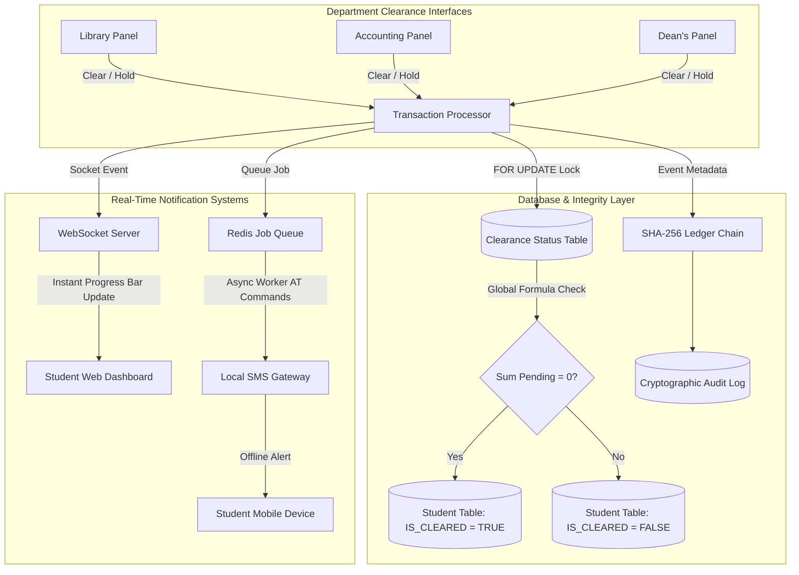

# **Title Defense Guide: SwiftClear**
*A Comprehensive Strategic Roadmap, System Architecture Deep-Dive, and Mock Q&A for the Capstone Title Defense*

---

## **1. Title Defense Alignment & Structural Overview**

### **The Core Shift**
Unlike conventional institutional websites that merely display general school information or basic static student profiles, **SwiftClear** operates as a **Transactional Workflow Automation Engine**. It solves the severe queue congestion and information asymmetry experienced at the end of semesters by digitizing departmental clearances into a real-time, audited relational state machine.

$$\text{SwiftClear} = \underbrace{\text{Relational Status Matrix}}_{\text{Sequential \& Parallel Approvals}} + \underbrace{\text{Cryptographic Audit Ledger}}_{\text{Non-Repudiation \& Anti-Tamper}} + \underbrace{\text{SMS Gateway Notification Queue}}_{\text{Offline Access Flow}}$$

### **System Target Metrics**
*   **Approval State Propagation Delay**: $<500\text{ms}$ from administrative click to student portal UI updates via WebSockets.
*   **SMS Deficiency Dispatch Latency**: $<5\text{s}$ from a department logging a deficiency to the student receiving an alert.
*   **State Integrity (Global Lock)**: $100\%$ mathematical reliability. A student's global status remains locked if:
    $$\sum \text{Pending\_Departments} > 0$$
*   **Database Concurrent Transaction Handling**: $>500$ transactions per second (TPS) during high-density end-of-semester clearance windows.
*   **Usability Score**: $>80$ on the System Usability Scale (SUS) during institutional trials.

---

## **2. Deep-Dive: 8-Section Defense Pacing (5-Minute Budget)**

### **Section 1 — The Title (15 Seconds)**
> **Slide 1: Formal Title & Registry**
> *   **Title**: *SwiftClear: A Web-Based Student Clearance Tracking System with Automated Departmental Sign-Offs*
> *   **Registry Code**: `BSIT-CAP3-2026-SC-V1`
> *   **Verbal Lead**: *"Good morning, members of the panel. We propose **SwiftClear**, a web-based student clearance tracking system that digitizes the fragmented, paper-based departmental clearance process. It establishes a centralized relational database to manage parallel departmental sign-offs, incorporates a cryptographic ledger for audit integrity, and utilizes WebSockets and SMS gateways to provide real-time deficiency tracking for students."*

### **Section 2 — The Scene (30 Seconds)**
> **Slide 2: The Physical Clearance Bottleneck**
> *   **Visual**: A split screen: on the left, a photo of long, crowded queues of students carrying paper clearance forms under the heat; on the right, a clean, modern glassmorphic dashboard loading in milliseconds.
> *   **The Hook**: *"At the end of every semester, thousands of tertiary students spend days queuing outside university offices. If they have an unreturned library book or a remaining lab fee, they only find out after hours of waiting in line. This physical congestion wastes student time, causes administrative strain, and generates massive paper waste. SwiftClear eliminates this friction by digitizing institutional workflows into a paperless clearance tracking engine."*

### **Section 3 — The Problem (45 Seconds)**
The proposed system addresses three distinct computer science and institutional limitations:
1.  **Administrative Inefficiency & Queue Congestion**: Students spend days visiting separate desks (Library, Laboratory, Accounting, Registrar) just to get physical signatures, leading to high administrative drag and campus congestion.
2.  **Deficiency Blindness**: Students have no proactive visibility into outstanding obligations (e.g. library book fines or medical certificates) until they physically reach a department head’s desk, resulting in wasted trips.
3.  **Vulnerable Audit Logs**: Paper clearance records are vulnerable to loss, damage, and unauthorized signatures. Institutional registrars lack an immutable, audited trail to verify graduation clearances, violating state auditing guidelines.

### **Section 4 — The Proposed System & Architecture (60 Seconds)**
We resolve this with a centralized, role-based workflow state machine.

### **Section 5 — Component Coverage Map (45 Seconds)**

| Component | Technology Stack | Implementation Role in SwiftClear | Falsifiable Verification Metric |
| --- | --- | --- | --- |
| **Web App (Admin)** | Laravel, TailwindCSS | Multi-tenant administrative dashboards with Role-Based Access Control (RBAC) to update clearance and deficiencies. | Average query response time $<150\text{ms}$ under peak admin load. |
| **Web App (Student)** | React.js / Vue.js | Real-time portal containing a visual progress bar and deficiency breakdown widget. | Progress bar animations sync via WebSockets within $<500\text{ms}$ of status change. |
| **Database Core** | PostgreSQL / MySQL | Manages relational entities and executes serialized transactions to prevent status race conditions. | Safe execution of $>500$ TPS without deadlock or database locks. |
| **Audit Ledger** | SHA-256 Chaining | Cryptographic record-linking engine to ensure audit log non-repudiation. | Automated daily integrity verification takes $<10\text{s}$ for 100,000 records. |
| **Offline Alerts** | Redis / SMS Gateway | Asynchronous worker queue translating backend updates into SMS messages via GSM gateways. | Notification dispatch latency $<5\text{s}$ under concurrent queues. |

### **Section 6 — The Novelty Claim (30 Seconds)**

**Slide 6: Transactional Deficiency Resolution & Cryptographic Non-Repudiation**
*   **The Claim**: SwiftClear is not just an online tracking table; it is a transactional clearinghouse. It introduces a relational status matrix that automates parallel approval workflows, coupled with a cryptographic ledger that secures administrative sign-offs against back-dated overrides.
*   **Contrast Table**:

| Feature | Standard SUC Portals (SIS) | Generic Workflow Tools (Trello) | SwiftClear (Ours) |
| --- | --- | --- | --- |
| **Clearance Focus** | Static student data display | Simple linear boards | Relational workflow state machine |
| **Parallel Approvals** | Manual data entry batches | Weak database enforcement | Automatic formula verification |
| **Deficiency Handling** | Text notes | Manual checklist | Transactional logging with fines |
| **Audit Trails** | Basic audit tables (editable) | System history logs (volatile) | Cryptographic hash chains (immutable) |
| **Offline Channels** | None | Email notifications only | Asynchronous SMS Gateway |

### **Section 7 — Scope & Boundaries (30 Seconds)**

**Slide 7: System Scope and Hard Boundaries**
*   **In Scope**:
    *   Role-Based access control (RBAC) isolating views by departments (e.g. Accounting has no access to Library data, in compliance with RA 10173).
    *   Dynamic progress percentage updates on student screens.
    *   Asynchronous job scheduling for SMS notifications.
    *   Cryptographic hash chain generation for administrative actions.
*   **Out of Scope**:
    *   **Payment Processing**: The system does *not* link to actual bank vaults. Fines are marked resolved *manually* by the accounting officer once the student pays cash or uploads an offline bank receipt.
    *   **Academic Grading**: The system does *not* calculate GPAs. It simply checks if the Registrar has marked the academic records deficiency resolved.

### **Section 8 — Difficulty Acknowledgment & Roadmap (45 Seconds)**

**Slide 8: Roadmap & Technical Risks**
*   **Hard Parts (Technical Challenges)**:
    1.  **Concurrent Row Locks**: Multiple admins updating a single student's status at the same time could lock rows, slowing down queries. We address this using PostgreSQL exclusive row locks (`FOR UPDATE`) combined with database index optimizations.
    2.  **Data Minimization (Data Privacy Act of 2012)**: Isolating student clearance data so departments only see what is relevant to their unit. Enforced via PostgreSQL Row-Level Security (RLS).
*   **Roadmap (4-Month Plan)**:
    *   *Phase 1 (Month 1-2)*: Relational DB setup, normalization, and Core Laravel/Tailwind administrative panels.
    *   *Phase 2 (Month 3)*: React/Vue Student WebSockets integration and Redis Asynchronous SMS Notification Queue.
    *   *Phase 3 (Month 4)*: SHA-256 Audit chain implementation, security penetrations, and stress load testing ($>500$ TPS).

---

## **3. Four Critical Defense Arguments**

### **Argument 1: The Administrative Overrides Defense (Integrity)**
*   **The Attack**: *"What prevents a tech-savvy student, or a database administrator, from logging directly into the SQL database and changing a status from 'PENDING' to 'APPROVED' manually to bypass clearances?"*
*   **The Rebuttal**: "The system implements a **Cryptographic Audit Ledger** using SHA-256 hashing to ensure complete non-repudiation."
*   **The Logic**:
    1.  Every status change is verified against the digital signature of the department head.
    2.  The database records are hashed using a chaining formula: $H_n = \text{SHA-256}(T_n \parallel A_n \parallel E_n \parallel S_n \parallel H_{n-1})$.
    3.  If an override is made directly in the SQL database, the chaining sequence breaks immediately. The system's daily audit checker detects the broken link and flags the target record, alerting the Registrar.

### **Argument 2: The Concurrency Lockout Defense (Performance)**
*   **The Attack**: *"During final exam week, thousands of students will be checking their portals while dozens of admins write approvals. How do you prevent database crashes or long load times?"*
*   **The Rebuttal**: "We employ **Exclusive Row Locks** for writes and offload notifications to an **Asynchronous Message Queue**."
*   **The Logic**:
    1.  Instead of locking entire database tables, PostgreSQL is configured to lock *only* the specific student row being edited using `SELECT ... FOR UPDATE` isolation.
    2.  Heavier workflows, such as rendering PDF clearances or sending SMS messages, are offloaded to **Redis Queue workers**, keeping the main web-server threads free and highly responsive.

### **Argument 3: The Data Privacy Compliance (RA 10173) Defense**
*   **The Attack**: *"You have a central system containing sensitive student deficiencies. How do you prevent a librarian from snooping on a student's disciplinary records or financial status?"*
*   **The Rebuttal**: "We enforce strict **Data Minimization** using database-level **Row-Level Security (RLS)**."
*   **The Logic**:
    1.  In compliance with RA 10173, the library administrator account is restricted to queries where `department_id` matches the Library unit.
    2.  Queries attempting to scan other department records return null, ensuring administrative staff can only see data they are legally authorized to access.

### **Argument 4: The Offline Accessibility Defense**
*   **The Attack**: *"What if a student lives in an area with poor internet access? How can they check their clearance progress if the web app is down or slow?"*
*   **The Rebuttal**: "SwiftClear features an integrated **SMS Gateway** that dispatches SMS notifications for every clearance milestone."
*   **The Logic**:
    1.  Students do not need to constantly refresh the portal. The system proactively pushes status updates to their mobile devices.
    2.  SMS messages are sent via an asynchronous cellular modem queue, ensuring high reliability even during internet outages on campus.
