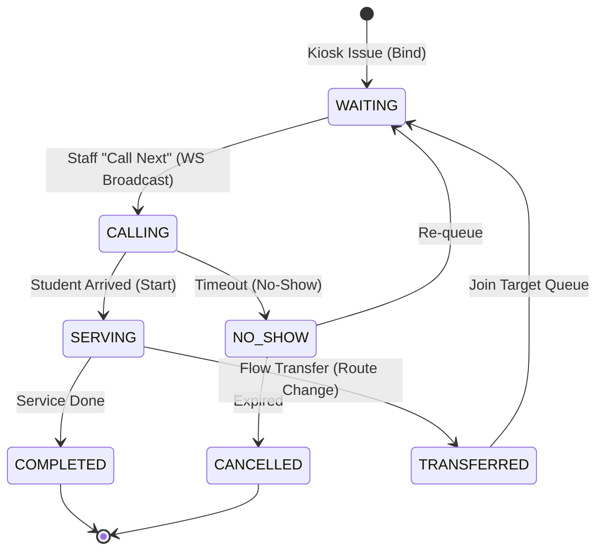
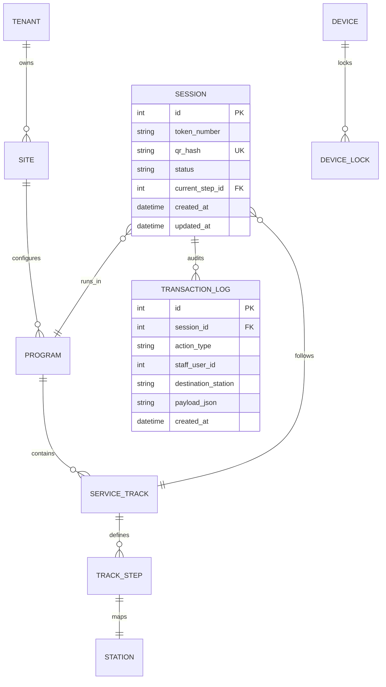
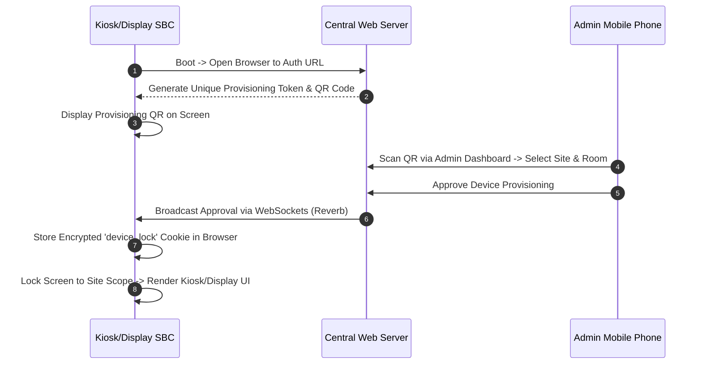

# **Theoretical Foundations and Multi-Surface Deployment of FlexiQueue: An Open-Source, Offline-First Queue Orchestration Platform for Institutional Service Lines**

*A comprehensive academic and engineering research specification detailing queueing theory models, multi-surface screen deployments, local-first database replication, write-once audit logs, and text-to-speech announcement pipelines in resource-constrained institutional environments.*

---

## **1. Introduction & Contextual Grounding**

In public institutions, tertiary education facilities, and State Universities and Colleges (SUCs) in developing regions like the Philippines, physical queueing ("pila") is an unavoidable administrative bottleneck. During peak academic events—such as semester enrollment, clearance sign-offs, graduation applications, and tuition fee payments—hundreds of students cluster around administrative offices. The registrar, accounting windows, scholarship desks, clinic, guidance office, and college libraries become highly congested environments.

This traditional queueing environment suffers from several structural failures:
1.  **Vocal announcement Fatigue & Auditory Masking**: Administrative clerks must repeatedly shout names or manually click simple, disconnected LED number displays. In crowded, echoing hallways, students regularly miss their turn, causing backlogs and leading to clusters of anxious crowds around windows.
2.  **Disjointed Service Routing (Dynamic Deficiencies)**: Academic transactions are sequential but decentralized. For example, a student lining up at the Registrar's window may be told they have an outstanding library fee. The student must leave the window, line up at the Cashier to pay, wait in a third line at the Library to clear the book, and then return to the Registrar—starting the entire queue journey from scratch. No mechanism exists to "transfer" or put a student's queue state on hold across offices.
3.  **Infrastructure Instability & Cost Barriers**: Commercial queue management systems (QMS) such as Qmatic or Wavetec require proprietary hardware and expensive enterprise licensing. Lightweight web solutions depend on constant internet access (WAN). In municipal areas where SUCs operate, frequent internet outages freeze cloud-based queue systems, rendering them useless during high-stakes enrollment windows.

**FlexiQueue** solves these issues by shifting queue management from static, cloud-first counters to an **offline-first, multi-surface orchestration platform** deployed on low-cost single-board computers (like Raspberry Pi or Orange Pi) running over the local area network (LAN). It coordinates a self-service triage kiosk, WebSocket-driven display boards, clerk calling dashboards, and a mobile public triage page into a unified state-driven service engine.

---

## **2. Queueing Theory & Dynamic Routing Foundations**

To systematically reduce wait times, FlexiQueue incorporates classical queueing theory models into its database routing and state progression engine.

### **The M/M/c Queueing Model**
Each program or service track in FlexiQueue behaves as a multi-server queueing system, represented under Kendall’s notation as **M/M/c**:
*   **Arrival Process (M)**: Student arrivals follow a Poisson distribution with an average arrival rate of $\lambda$ (tokens per hour).
*   **Service Process (M)**: Service times follow an exponential distribution with an average service rate of $\mu$ (tokens served per hour per window).
*   **Servers (c)**: The number of active, assigned staff terminals ($c$) open for that specific station track.

The system utilization factor ($\rho$), which represents the average fraction of time that the windows are busy, is defined as:
$$\rho = \frac{\lambda}{c \cdot \mu}$$

To prevent infinite queue expansion, the system must maintain $\rho < 1$. Under this condition, the probability that an arriving student must wait in line ($P_q$) is governed by the Erlang C formula:
$$P_q = \frac{\left(\frac{(c\rho)^c}{c!(1-\rho)}\right)}{\sum_{k=0}^{c-1} \frac{(c\rho)^k}{k!} + \frac{(c\rho)^c}{c!(1-\rho)}}$$

### **Little's Law and Waiting Time Estimation**
FlexiQueue utilizes Little's Law to display real-time wait times on student mobile triage interfaces. Little's Law states that the average number of clients in a stationary queueing system ($L$) is equal to the long-term average effective arrival rate ($\lambda$) multiplied by the average time ($W$) that a client spends in the system:
$$L = \lambda \cdot W$$

Separating this into queue waiting time ($W_q$) and service time:
$$W_q = \frac{L_q}{\lambda}$$

Where $L_q$ is the average number of students waiting in the queue. FlexiQueue's backend dynamically calculates the estimated wait time ($E_{wait}$) for a newly issued token based on active queue length and historical service rates:
$$E_{wait} = \frac{N_{waiting}}{c \cdot \mu_{avg}}$$
Where $N_{waiting}$ is the number of pending tokens ahead of the student in that track, and $\mu_{avg}$ is the moving average of service completions over the past 30 minutes.

### **Dynamic Flow Engine Routing & State Transitions**
Rather than treating a queue token as a static number, FlexiQueue models each token's journey as an audited state machine governed by the `FlowEngine`. 



When a student has a multi-office dependency (e.g. clearance deficiency), the clerk clicks **Transfer** on the Staff Panel. The `FlowEngine` updates the session's active program, changes its track step, and places the token back into the target department's `WAITING` queue. The student retains their original token ID (preserving their overall identity), but is routed dynamically through the school's service lines.

---

## **3. Multi-Surface Topology & Hardware Deployment**

FlexiQueue's physical architecture relies on a coordinated set of screen-based deployment surfaces, each serving a specific participant in the queue cycle.

```
       [ Public Mobile Triage ] (Student Phone - Scan QR to Join/Track)
                  ▲
                  │ HTTP
                  ▼
[ Self-Service Kiosk ] ──(LAN/WebSockets)──► [ WebSocket Display Board ]
  (Touchscreen SBC + Printer)                 (Large TV Monitor + TTS Audio)
                  ▲                                    ▲
                  │                                    │ WebSockets
                  └─────────► [ Staff Panel ] ─────────┘
                            (Clerk Web App)
```

### **1. Self-Service Kiosk Surface**
*   **Hardware**: A Raspberry Pi 4 or Orange Pi One single-board computer connected to a 10-inch capacitive touchscreen, a QR code camera scanner, and a thermal receipt printer.
*   **Functional Interface**: A simplified full-screen browser interface running in kiosk mode. Students walk up, select their target service program (e.g., Registrar, Cashier, Advising, Library), input minimal details, and click "Print Ticket".
*   **Settings Cascade**: Custom Kiosk parameters (timeouts, camera status, printer thermal density) are resolved from the database settings cascade and enforced locally.

### **2. WebSocket-Driven Display Board Surface**
*   **Hardware**: An LCD/LED TV monitor mounted in high-traffic hallways, driven by a cheap Raspberry Pi Zero W running a locked browser.
*   **Functional Interface**: A high-visibility dashboard that displays the current "Now Serving" tickets alongside their designated Windows (e.g., `REG-101 at Window 1`). When a new token is called, the display board flashes visually, updates the queue lists, and triggers the audio pipeline.
*   **Audio Pipeline**: The board runs a local Text-to-Speech (TTS) audio synthesizer that broadcasts announcements through attached speakers.

### **3. Staff Station Panel Surface**
*   **Hardware**: Existing office desktop computers or laptops used by registrar clerks, cashiers, and advisors.
*   **Functional Interface**: A Svelte 5 staff panel running in a standard web browser.
*   **Controls**: Clerks have four primary actions:
    *   `Call Next`: Pulls the highest priority token from the track step.
    *   `Complete`: Concludes the current service and logs the transaction.
    *   `Transfer`: Forwards the active ticket to another station queue.
    *   `Hold / No-Show`: Suspends the ticket if the student does not appear within the allotted timeout window.

### **4. Public Mobile Triage Surface**
*   **Hardware**: Student-owned smartphones.
*   **Functional Interface**: By scanning a QR code posted at the building entrance or printed on the kiosk ticket, students access a lightweight web page (`/display/status/{qr_hash}`). This page displays the real-time queue list, their relative position, and their estimated waiting time, allowing them to wait in ventilated outdoor spaces instead of congested corridors.

---

## **4. Database Schema & Transactional Integrity**

FlexiQueue uses a relational database schema designed for high-concurrency write operations.

### **Entity-Relationship Model (3NF)**



### **The Immutable Audit Ledger (`transaction_logs`)**
To comply with the Commission on Audit (COA) guidelines for public institutions, every state change in a queue session must be recorded in an immutable ledger. 
*   **Database Constraints**: The `transaction_logs` table is append-heavy. DB level triggers or application hooks block any SQL `UPDATE` or `DELETE` commands on this table.
*   **Structure**: Every log stores the exact event transition, the clerk's user ID, the station ID, and a JSON payload detailing the parameters of the transition.

### **SQLite Edge and MariaDB Central Sync**
For local-first resilience, individual sites (campuses) deploy a local server running **SQLite** (a single-file, zero-maintenance relational engine suitable for SBC flash cards). All local transactions write immediately to the SQLite database. 
An asynchronous background sync service monitors WAN connectivity. When the internet is online, local `transaction_logs` rows are pushed to the **MariaDB** central cloud database via tokenized API payloads, guaranteeing centralized records and reporting without sacrificing local availability.

---

## **5. Device Authorization & Lock Model**

Publicly deployed screens (kiosks, displays) are highly vulnerable to user tampering. FlexiQueue addresses this via an automated **Device Lock & Provisioning Pipeline**.

### **Provisioning Sequence**



*   **EnforceDeviceLock Middleware**: The application intercepts all requests to public pages. If the browser lacks a valid, signed `device_lock` cookie, it is redirected to the provisioning screen. 
*   **Cookie Lockdown**: Once provisioned, the device lock cookie binds the browser session to a specific Site and Program mode. A user cannot escape the fullscreen kiosk view or display layout to access the admin dashboard or staff controls.

---

## **6. Text-to-Speech (TTS) Calling Pipeline**

Clear, localized audio calls are critical for removing announcement fatigue. FlexiQueue breaks token calls into structured segments, enabling customizable voice phrases.

### **Announcer Structure**
```
┌────────────────────────────────────────────────────────┐
│                      TOKEN CALL                        │
├───────────────────┬───────────────────┬────────────────┤
│    Pre-Phrase     │   Spoken Token    │  Bridge Tail   │
│   "Now serving"   │     "R-101"       │   "please go"  │
└───────────────────┴───────────────────┴────────────────┘
                                │
                                ▼
┌────────────────────────────────────────────────────────┐
│                   STATION DIRECTIONS                   │
├───────────────────────────────┬────────────────────────┤
│       Connector Phrase        │    Station Location    │
│            "to"               │      "Window 1"        │
└───────────────────────────────┴────────────────────────┘
```

*   **Segment 1 (Token Call)**: Combines the introductory phrase, the spelled-out token digits, and a trailing bridge (e.g. *"Now serving ticket registrar one-zero-one..."*).
*   **Segment 2 (Station Directions)**: Appends the routing connector and station name (e.g. *"...please proceed to Window 1"*).
*   **Adapter Pattern & Synthesizer Selection**: The system utilizes an abstract `TtsEngine` contract. At runtime, the browser display board utilizes the native HTML5 **Web Speech API** for zero-cost, localized speech synthesis. Higher tiers can switch to a cloud-based ElevenLabs or Google Cloud TTS adapter for high-fidelity regional voices (e.g. Tagalog or Ilocano accents).

---

## **7. Policy & Legal Compliance**

### **Data Privacy Act (DPA - RA 10173) Compliance**
As a queue system handling student journeys, FlexiQueue enforces strict privacy boundaries:
1.  **Minimization**: Kiosks collect only proportional data. Students can join queues anonymously (producing a standard random token with no identifying records) or bind their profiles via encrypted student ID hashes.
2.  **Visual Masking**: Public display boards do not expose student names or emails. They display only the alphanumeric token identifier (`REG-105`).
3.  **Data Retention**: Local SQLite database tables purge completed session data every 24 hours, transferring the transactional audit records to the central cloud for long-term storage under strict database access control lists (ACLs).

### **COA Audit Integrity**
To justify graduation credentials, scholarship disbursements, and fee collection clearances to government auditors, the system guarantees non-repudiation:
*   Every change in a token status is logged with the clerk's timestamp, IP address, and unique user signature.
*   The transaction log database table uses a strict write-once configuration, meaning even database administrators cannot modify historical logs without breaking database constraints.

---

## **8. Related Literature & Gap Analysis**

### **Commercial Solutions vs. Academic Gaps**
Existing commercial queue management systems (such as QLess and Qmatic) are built as closed proprietary ecosystems, making them cost-prohibitive for municipal public high schools and SUCs in developing nations. 

While academic research exists on queue optimizations using Poisson models, there is a clear **engineering gap**: there are no documented open-source queue architectures that combine:
1.  Local-first LAN edge synchronization with SQLite to survive local connectivity failures.
2.  Multi-surface screen locking (DeviceLock) to turn low-cost single-board computers (Raspberry Pi/Orange Pi) into secure public kiosks and display panels.
3.  Bilingual Text-to-Speech (TTS) engines optimized for local dialects.

FlexiQueue addresses this gap, providing a secure, affordable, and flexible queueing infrastructure for institutional service lines.
