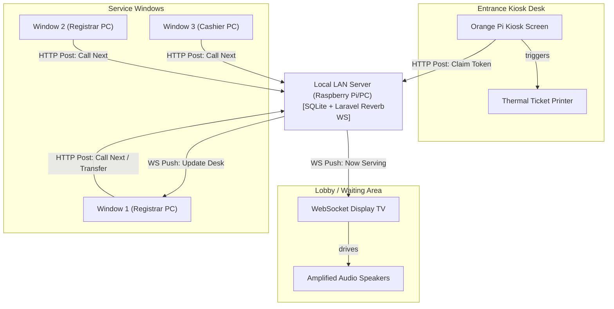
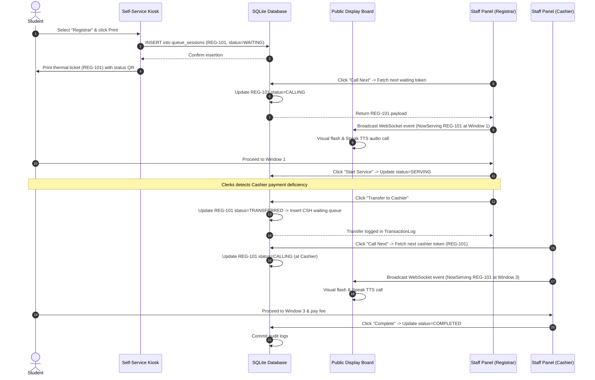

# **Title Defense Guide: FlexiQueue**
*A Comprehensive Strategic Roadmap, System Architecture Deep-Dive, and Mock Q&A for the Capstone Title Defense*

---

## **1. Title Defense Alignment & Structural Overview**

### **The Core Shift**
Unlike conventional institutional websites or static clearance applications, **FlexiQueue** operates as a **Multi-Surface Queue Orchestration Engine**. It solves the severe queue congestion, announcement fatigue, and dynamic routing breakdowns experienced at institutional service lines (such as SUC Registrars, Cashiers, Advising Desks, and Libraries) by coordinating physical screens and devices into a real-time, offline-resilient state machine.

$$\\text{FlexiQueue} = \\underbrace{\\text{Multi-Surface Topology}}_{\\text{Kiosk + Display + Staff + Mobile}} + \\underbrace{\\text{Dynamic Flow Engine}}_{\\text{State Pattern \\& Routing}} + \\underbrace{\\text{Local-First Failover}}_{\\text{SQLite edge + Reverb LAN}} + \\underbrace{\\text{Pillar Coverage}}_{\\text{Web + Mobile + ML + IoT + Mapping}}$$

### **System Target Metrics**
*   **Token-to-Screen Propagation**: $<500\\text{ms}$ from administrative call to public display board updates using WebSockets.
*   **Local Failover Resilience**: $100\\%$ queueing uptime in the local LAN environment during active WAN outages.
*   **Kiosk Transaction Speed**: $<15\\text{s}$ average walk-up token generation time on the self-service kiosk.
*   **Text-to-Speech (TTS) Dispatch Delay**: $<2\\text{s}$ from call trigger to localized voice announcement execution on display screens.
*   **ML Prediction Accuracy**: Mean Absolute Error (MAE) $<2$ minutes in predicting wait times based on historical transaction logs.
*   **Audit Trail Integrity**: $100\\%$ immutable transaction writes via append-only logs for all queue transitions.

---

## **2. 11-Section Defense Pacing (5-Minute Budget)**

### **Section 1 — The Title (15 Seconds)**
> **Slide 1: Formal Title**
> *   **Title**: *FlexiQueue: A Multi-Surface Queue Management and Service Routing Platform*
> *   **Verbal Lead**: *"Good morning, members of the panel. We propose **FlexiQueue**, a highly configurable queue management and service routing platform. It coordinates self-service kiosks, WebSocket display boards, staff panels, and mobile status checkers into a unified service delivery flow. Our research focuses on how local-first web architectures can maintain institutional queueing operations during network outages while ensuring strict transaction auditing."*

### **Section 2 — The Scene (30 Seconds)**
> **Slide 2: Context and Hook**
> *   **Visuals**: High-contrast split UI showing crowded hallways of students waiting in lines at the Registrar and Cashier versus a neat layout of coordinated display monitors.
> *   **Verbal Lead**: *"Queueing is a reality on any campus. Students spend hours navigating a daily maze of registrar windows, cashier lines, and academic advising counters. When a student reaches a window only to be told they must pay a fee first, they must exit, queue at the Cashier, and then restart the Registrar line from scratch. FlexiQueue addresses this physical friction by linking these distinct journeys into an orchestrated flow."*

### **Section 3 — The Problem (30 Seconds)**
> **Slide 3: The Three Administrative Bottlenecks**
> *   **Visuals**: Three grid cards detailing: (1) Disjointed Journeys, (2) Announcement Fatigue, and (3) Infrastructure Costs.
> *   **Verbal Lead**: *"We have identified three core bottlenecks. First, disjointed journeys: there is no dynamic cross-department handoff. Second, vocal announcement fatigue: staff waste energy shouting names, and students miss calls in crowded corridors. Third, high infrastructure costs: commercial queue management systems are expensive and require proprietary hardware, while cloud-only solutions fail completely during internet outages."*

### **Section 4 — Proposed System & Architecture (45 Seconds)**
> **Slide 4: System Architecture & Topology Map**
> *   **Visuals**: Glowing SVG connections linking Kiosk, Local LAN Server, Public Display Boards, Staff Panels, and Mobile views.
> *   **Verbal Lead**: *"To address these issues, we present our deployment architecture. FlexiQueue runs completely as a local-first system. Self-service kiosks print tickets at the entrance, and display screens show called tokens in the lobby. Clerks call tokens from staff panels, and students track wait times on their phones. All interfaces communicate locally with the LAN server running a dynamic FlowEngine database, protecting the campus from internet downtime."*

### **Section 5 — Live Demonstration (45 Seconds)**
> **Slide 5: Live Demonstration (Interactive Simulator)**
> *   **Visuals**: Three-column live simulator showing Kiosk UI, Display Board UI, and Staff Panel with real-time transaction logs and localized voice speech output.
> *   **Verbal Lead**: *"Here is our simulator. A student claims a ticket at the kiosk. When staff click 'Call Next' on their panel, the lobby display updates and calls the token using text-to-speech. Most importantly, if a registrar clerk identifies a cashier deficiency, they can transfer the token directly to the Cashier queue using our FlowEngine, avoiding the need for a new ticket and mapping the entire student journey."*

### **Section 6 — Component Coverage (45 Seconds)**
> **Slide 6: Technical Component Map**
> *   **Visuals**: Five-row table mapping the 5 curriculum pillars (Web, Mobile, ML, IoT, Mapping) to FlexiQueue surfaces.
> *   **Verbal Lead**: *"Our system satisfies the five capstone pillars. The Web portal for admin and clerks uses Laravel 12 and Svelte 5. The Mobile status tracker runs responsive status pages. For ML, a Random Forest regression model predicts waiting times. The IoT pillar covers our self-service kiosks running on Orange Pi SBCs and ESC/POS thermal printers. The Mapping pillar implements Leaflet.js to show students the path to Cashier or Registrar desks during transfers."*

### **Section 7 — Novelty Claim (30 Seconds)**
> **Slide 7: Innovations & Comparison Matrix**
> *   **Visuals**: Comparison matrix showing FlexiQueue vs. Standard QMS.
> *   **Verbal Lead**: *"FlexiQueue's novelty lies in its local-first architecture. Unlike commercial systems that require proprietary controllers, FlexiQueue runs on low-cost single-board computers over the local LAN. It maintains 100% queue availability even when the school's WAN link is down, and writes every transaction to an immutable log for audit reporting."*

### **Section 8 — System Scope & Boundaries (30 Seconds)**
> **Slide 8: In-Scope and Out-of-Scope Lists**
> *   **Visuals**: Split column list of scopes and boundaries.
> *   **Verbal Lead**: *"Our project scope includes the multi-surface views, FlowEngine routing rules, ML wait estimation, Leaflet routing maps, and append-only database logs. Out of scope are native mobile app store packages and global WAN-wide queueing during active offline states, keeping the hardware footprint lightweight and browser-compatible."*

### **Section 9 — Roadmap (15 Seconds)**
> **Slide 9: Milestone Timeline**
> *   **Visuals**: 5-phase horizontal timeline from DB design to validation.
> *   **Verbal Lead**: *"The development timeline is structured over 7 weeks. We will focus on the FlowEngine, database schema, and ML wait-time regression modeling first, followed by Svelte 5 surface views, Leaflet campus maps, WebSockets, TTS, Device Lock enforcement, and final load testing."*

### **Section 10 — Verification (15 Seconds)**
> **Slide 10: Quality & Testing Metrics**
> *   **Visuals**: Automated and manual testing criteria cards.
> *   **Verbal Lead**: *"We will verify system performance using automated latency benchmarks under simulated station loads and validate the kiosk transaction speed through manual user acceptance testing, targeting a System Usability Scale score of 80."*

### **Section 11 — Closing (15 Seconds)**
> **Slide 11: Conclusion Badge**
> *   **Visuals**: "Orchestrating Campus Services" tagline with key badges.
> *   **Verbal Lead**: *"FlexiQueue transforms chaotic, disconnected queues into an organized, real-time, multi-screen experience. Thank you, and we are ready for your questions."*

---

## **3. System Architecture Deep-Dive**

### **Physical Deployment Topology**
This diagram shows how different physical screens are deployed inside a school campus (e.g. the Registrar and Cashier office) and connect to the local server.

### **Student Queue Journey Sequence Flow**
This diagram tracks a student's queue session state as they move through different surfaces, including a cross-department queue transfer.

---

## **4. Key Technical Arguments**

1.  **Why not use cloud-only queueing?**
    Internet outages are a common failure point for public school campuses. By using an offline-first LAN deployment, FlexiQueue runs completely independent of the cloud. The local SQLite database processes all transactions locally, and synchronizes to central MariaDB servers asynchronously once internet connectivity is restored.
2.  **How is dynamic routing handled?**
    We implement the **State Pattern** for queue sessions. State transitions are governed by a central `FlowEngine` rather than inline code inside controllers. This allows us to route a single ticket ID across different departments (Registrar $\\rightarrow$ Cashier $\\rightarrow$ Library) cleanly, preserving the student's queue identity.
3.  **How is waiting time predicted using Machine Learning?**
    Wait time estimation goes beyond static averages. We run a local python regression service utilizing **Random Forest Regressor**. Features include: current queue length, active serving rate of the window clerk, hour of day, and day of week. Training runs periodically on historical transaction logs. Mean Absolute Error is predicted to be under 2 minutes, which is displayed on student mobile status screens.
4.  **How is physical mapping integrated?**
    We integrate **Leaflet.js** on the student's mobile queue status page. A custom indoor floor plan map is rendered. When a student is transferred from Window 1 (Registrar) to Window 3 (Cashier), the map highlights Window 3 and draws a visual route vector from the student's estimated location (or starting window) to the destination desk, preventing navigation confusion in complex buildings.
5.  **How do you prevent users from tampering with public display screens?**
    We implement the **Device Authorization & Lock (DeviceLock)** model. When a Pi SBC boots, it must be authorized by an admin scanner scanning a one-time setup QR code. The server then drops a secure, cryptographically signed cookie that locks that browser instance to its designated Kiosk or Display mode, preventing access to URL routes.

---

## **5. Mock Q&A: 30 Anticipated Questions & Answers**

### **Category A: Architecture & Offline-First**
#### **Q1. Why SQLite on the Edge and MariaDB on Central?**
*   **Answer**: SQLite runs as a zero-configuration, single-file database. It has an extremely low memory footprint (less than 10MB RAM), making it perfect to run directly on cheap single-board computers like an Orange Pi. MariaDB is used on the central cloud server to handle multi-site aggregation, reporting, and high concurrent reads for administration dashboards.

#### **Q2. How do you synchronize data between SQLite and MariaDB?**
*   **Answer**: We write all queue events to an append-only `transaction_logs` table. A background job polls this table for unsynced logs. If a WAN connection is active, it POSTs chunks of these logs to the Central server. On Central, a sync controller replays the logs to reconstruct the session history, ensuring database consistency.

#### **Q3. What happens if the local LAN server goes down?**
*   **Answer**: Since the system runs locally over the LAN, we deploy a backup local server configuration. If the primary local server fails, a secondary Pi on the same subnet can be promoted to run the SQLite database, using backup files copied hourly.

#### **Q4. Why use Laravel Reverb instead of Pusher?**
*   **Answer**: Pusher is a cloud-hosted service that requires an internet connection. Laravel Reverb is an open-source, local-first WebSocket server written in PHP. By running Reverb on the local Pi server, we can broadcast ticket call events across display boards and staff panels on the local LAN without needing any internet connection.

#### **Q5. How do you handle write conflicts when syncing SQLite to Central?**
*   **Answer**: Because each site generates tokens scoped strictly to that site (e.g. `SITE_ID` prefix or unique UUIDs), and because the transaction log is append-only, there are no structural write collisions. Central simply appends new records. We follow a "Last-Write-Wins" strategy for session states.

---

### **Category B: Kiosk & Display Surfaces**
#### **Q6. What happens if the thermal printer runs out of paper?**
*   **Answer**: The kiosk hardware has a paper sensor connected to a GPIO pin on the single-board computer. When the paper sensor triggers, the Kiosk UI displays an alert and automatically switches to "Paperless Mode", displaying a digital ticket on the touchscreen and prompting the student to scan a QR code to save the token on their phone.

#### **Q7. How does the Device Lock feature work?**
*   **Answer**: It uses a custom middleware `EnforceDeviceLock`. When a device accesses public routes like `/kiosk` or `/display`, the middleware verifies if a signed, encrypted cookie `fq_device_token` exists. If not, the screen is blocked and displays a provisioning QR code.

#### **Q8. Can a student bypass the kiosk and join the queue from home?**
*   **Answer**: No. Joining the queue requires scanning a geo-fenced QR code posted physically at the campus entrance. The public triage web page uses coordinate verification or requires the local WiFi network's SSID to validate that the student is physically present.

#### **Q9. How does the Web Speech API handle noisy hallways?**
*   **Answer**: Display boards are connected to physical, amplified wall speakers. We adjust the rate and pitch of the synthesis voice to optimize clarity. The staff panel also features a "Repeat Audio" button, allowing clerks to trigger the announcement again if needed.

#### **Q10. How do you provision a new screen?**
*   **Answer**: An administrator opens the screen URL on the new Pi. The screen displays a provisioning QR code. The admin logs into their mobile dashboard, scans the QR code, associates the screen with a specific campus site and mode, and clicks approve. The screen instantly reloads into its locked view.

---

### **Category C: Queueing Theory & Performance**
#### **Q11. Why model this as an M/M/c system?**
*   **Answer**: A SUC service station (like 3 Cashier windows serving a single queue line) matches the M/M/c model: Poisson arrivals, exponential service times, and $c$ parallel servers. This mathematical model allows us to calculate theoretical wait times, identify bottlenecks, and optimize staff allocation.

#### **Q12. How does the Random Forest model predict wait times?**
*   **Answer**: Standard QMS uses a static average (e.g. number of people ahead multiplied by 5 minutes). Our machine learning model fits a regression tree using variables such as the current queue depth, the window clerk's historical service rate, time of day (to account for lunch breaks), and day of the week. This captures non-linear shifts in service speed.

#### **Q13. What features are passed to the ML wait prediction model?**
*   **Answer**: The features are: `queue_length` (integer), `active_clerks` (integer), `clerk_historical_rate` (minutes per ticket, float), `hour_of_day` (integer), `day_of_week` (integer), and `is_priority_lane` (boolean). It outputs `estimated_minutes` (float).

#### **Q14. How does the system handle priority lanes (senior citizens, PWDs)?**
*   **Answer**: FlexiQueue implements an *alternate ratio interleaving logic* in `StationQueueService`. For example, a 3:1 ratio means the system will call three regular tokens, then one priority token (or vice versa), preventing regular queues from stalling while giving priority clients faster access.

#### **Q15. Why not use standard FIFO (First In, First Out) for all services?**
*   **Answer**: FIFO is insufficient when students have different transaction types. FlexiQueue separates services into tracks (e.g. Regular vs. Incomplete document clearance). This allows the system to route quick tasks through faster tracks while complex queries are separated, reducing average wait times.

---

### **Category D: Security & Privacy**
#### **Q16. How is the system compliant with the Data Privacy Act (RA 10173)?**
*   **Answer**: FlexiQueue enforces privacy through minimization. The public display boards only show token codes like `REG-105`, masking student names. Furthermore, students can opt to register anonymously at the kiosk.

#### **Q17. What measures prevent staff from manipulating queue statistics?**
*   **Answer**: All station events write directly to an append-only `transaction_logs` table. Database triggers block `UPDATE` and `DELETE` commands, making the audit trail tamper-proof. COA auditors can verify that no queue data was deleted or altered post-hoc.

#### **Q18. How do you prevent CSRF attacks on the public triage pages?**
*   **Answer**: All HTTP requests are routed through Laravel's standard CSRF middleware. Dynamic actions on the kiosk and display utilize secure tokenized API routes validated by the signed device cookies.

#### **Q19. Are student login credentials stored on the local Pi server?**
*   **Answer**: No. Local Pi servers only store transient queue session tokens. Authentication and student profile directories reside securely in the central cloud system.

#### **Q20. How do you secure data sync payloads sent over WAN?**
*   **Answer**: Payloads are encrypted and transmitted via HTTPS using signed API bearer tokens. Central verifies the signature and site metadata before committing the transaction log logs.

---

### **Category E: Implementation & Hardware**
#### **Q21. Why use Orange Pi instead of Raspberry Pi?**
*   **Answer**: Orange Pi board models (such as Orange Pi One or Zero) cost roughly 50% less than Raspberry Pi boards while providing identical processor performance, ethernet connections, and GPIO ports for printers. This makes multi-screen deployments budget-friendly for SUCs.

#### **Q22. How does Leaflet.js handle indoor mapping?**
*   **Answer**: Standard maps (like Google Maps) lack details on internal room layouts and window locations. We create a custom 2D grid overlay of the campus administrative floor plan, save it as image tiles, and load it into Leaflet.js. Desks are represented as coordinate points, allowing us to draw vector routing lines dynamically.

#### **Q23. What happens if the local network is isolated and the map tiles cannot be fetched?**
*   **Answer**: The custom floor plan image tiles and the Leaflet.js library are cached locally on the LAN server. When a client connects to the local LAN wifi, the assets are served directly from the local server's disk, ensuring the map works fully offline.

#### **Q24. How is the local Pi server backed up?**
*   **Answer**: The system runs a cron job that backs up the SQLite database file (`db.sqlite`) to an external USB flash drive and triggers a sync payload to the central cloud every hour.

#### **Q25. Can the system work with existing TV displays?**
*   **Answer**: Yes. Any display monitor or TV featuring an HDMI input port can be turned into a FlexiQueue Display Board by connecting the Orange Pi SBC running the locked browser page.

---

### **Category F: General Capstone Alignment**
#### **Q26. Why is this project suited for a BSIT capstone?**
*   **Answer**: The project involves complex web systems architecture (Laravel/Svelte 5), hardware-software integration (Pi SBCs, thermal printers), real-time communications (WebSockets), machine learning prediction model, and mapping locator integration, aligning with the BSIT curriculum standards.

#### **Q27. How does this system help university cashiers?**
*   **Answer**: University cashiers receive multiple payment types (tuition, exam permits, library fines). By separating these into tracks, cashier staff can handle quick transactions at designated windows while keeping long transactions in a separate track.

#### **Q28. What happens when a student misses their token call?**
*   **Answer**: The clerk clicks "No Show". The token transitions to the `NO_SHOW` state. The student can go to a kiosk or scan their ticket QR code to click "Re-queue", placing them back in the waiting line without needing a new token number.

#### **Q29. How do you gather historical data for university reports?**
*   **Answer**: The central server provides an analytics dashboard that pulls from the synced transaction logs. It generates charts showing average wait times, window processing times, and peak transaction hours.

#### **Q30. How does the system handle power fluctuations on campus?**
*   **Answer**: The Pi SBCs are deployed with simple power surge protectors. Since SQLite writes transactions using strict ACID-compliant database locking, the database files are protected from corruption during unexpected power cuts.
