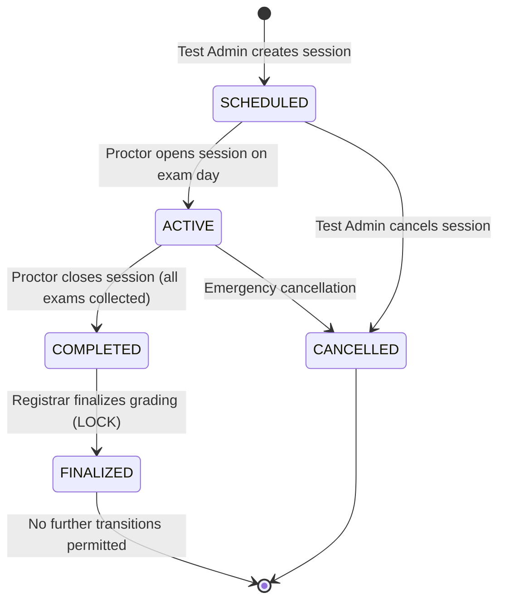
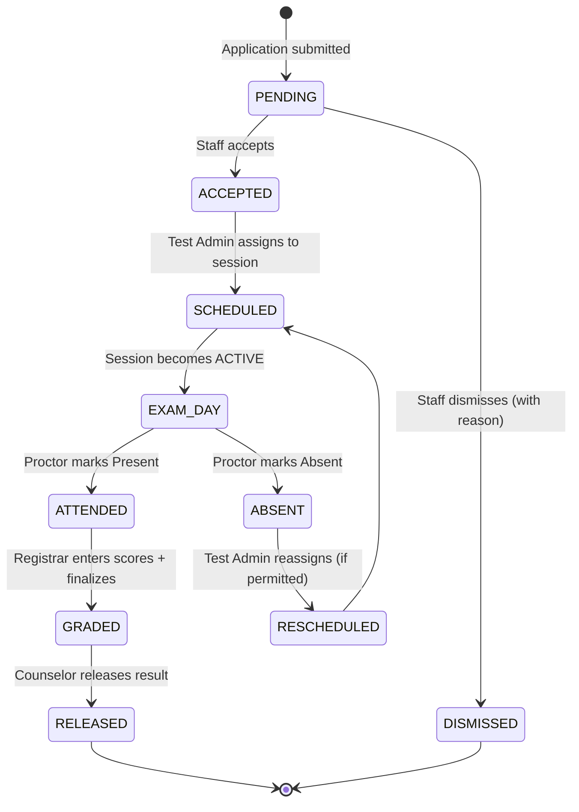
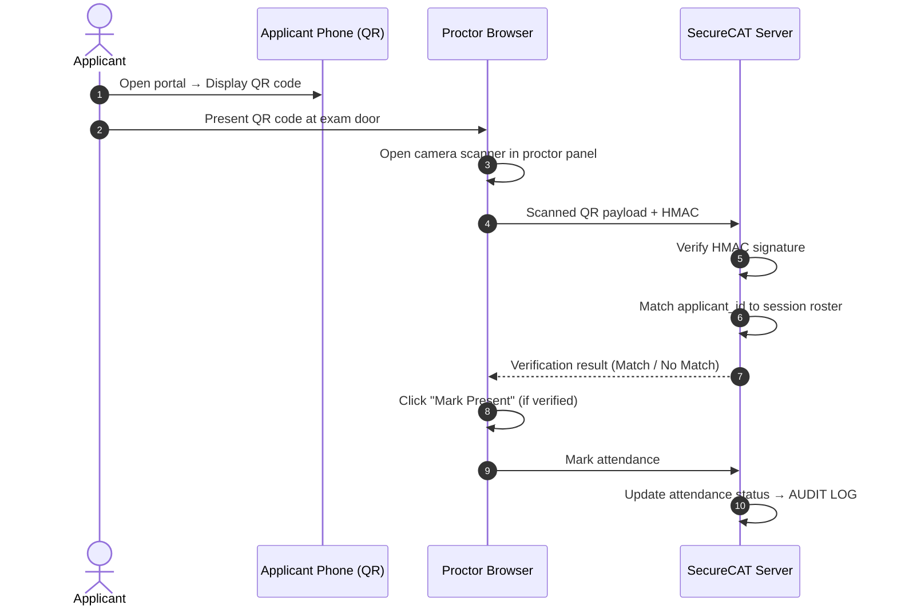

# **Theoretical Foundations and IAS-Grounded Architecture of SecureCAT: A Role-Based College Admission Testing System for Institutional Service Lines**

*A comprehensive academic and engineering research specification detailing Information Assurance and Security principles, role-based access control models, state-guarded workflow machines, immutable audit logging, and retrieval-augmented generation for applicant support in resource-constrained institutional environments.*

---

## **1. Introduction & Contextual Grounding**

At ISPSC Tagudin, the College Admission Test (CAT) is the gateway through which prospective students enter the institution. Every applicant must pass through this process. The volume, the stakes, and the coordination demands make the CAT one of the most operationally complex tasks handled by the Guidance and Registrar Offices.

Traditionally, the entire CAT process runs on paper forms, manual scheduling across disconnected spreadsheets, and fragmented communication between applicants, proctors, and administrators. This environment suffers from several structural failures:

1.  **Identity Verification Gaps**: On exam day, identity is verified by visual inspection of a physical ID card. There is no mechanism to link the person sitting in the exam room to the applicant who registered online. Impersonation risk is real and unaddressed.
2.  **Data Disconnectedness & Absent Accountability**: Staff manage applicant data across spreadsheets, email threads, and handwritten rosters. There is no unified view. Changes in one spreadsheet are not reflected in another. There is no audit trail — if someone modifies a score or status, there is no record of who made the change, when, or why.
3.  **Zero Applicant Support During Waiting Period**: Between application submission and result release — a window that can span weeks — applicants have no access to information. They email the office for updates, call staff, or show up in person asking about their status. This overloads the Guidance and Registrar Offices with repetitive inquiries.

**SecureCAT** (Secure College Admission Testing) addresses these failures by shifting the admission pipeline from a fragmented, manual process to a **unified, role-gated, IAS-grounded web application**. It enforces strict role-based access control across four distinct user roles, implements state-guarded workflows that prevent invalid operational transitions, maintains immutable audit logs for non-repudiation, and provides a RAG-grounded AI Companion that answers applicant queries from curated institutional knowledge.

---

## **2. Information Assurance & Security Foundations**

### **2.1 The CIA Triad in Admission Testing**

The foundational security model for SecureCAT is the CIA triad (Confidentiality, Integrity, Availability), extended with Accountability and Non-Repudiation.

| IAS Principle | Admission Testing Application | SecureCAT Implementation |
| :--- | :--- | :--- |
| **Confidentiality** | Applicant personal data and exam scores must not be visible to unauthorized roles | RBAC: Applicants see only their own data; proctors see attendance, not scores; registrars see scores, not counseling notes |
| **Integrity** | Score data must not be modifiable after formal finalization | Database-level finalization lock prevents post-commit modifications; audit trail records every pre-finalization change |
| **Availability** | The system must be operational on exam day, especially for proctoring | Self-contained Laravel application with no external dependencies for core functionality; database and app server run locally |
| **Accountability** | Every action in the system must be attributable to a specific actor | Audit logs record actor ID, action type, affected entity, and timestamp for every state-changing operation |
| **Non-Repudiation** | Actors cannot deny actions they performed | Append-only audit logs with database-level UPDATE/DELETE prevention |

### **2.2 Threat Model for Admission Testing Systems**

The following threat model identifies the primary adversaries and attack vectors specific to a college admission testing context:

| Threat | Actor | Attack Vector | Mitigation in SecureCAT |
| :--- | :--- | :--- | :--- |
| Score tampering | Internal (Registrar staff) | Direct database modification or UI manipulation | Finalization lock + audit trail with immutable logging |
| Impersonation at exam | External (substitute examinee) | Presenting another applicant's ID card | QR-based identity verification with HMAC-signed tokens |
| Unauthorized result access | Applicant / External | Accessing another applicant's result page | Laravel Policy: `ApplicantPolicy::viewResult` verifies requesting user owns the record |
| Privilege escalation | Any logged-in user | Attempting to access role-restricted endpoints | Route-level Gates + Policy-based authorization (dual enforcement) |
| Data exfiltration | Internal (any role) | Bulk data export | Role-scoped queries; no bulk export endpoints for sensitive data |
| Social engineering | External | Applicant impersonating staff via email | No email-based data revelation; all data access requires portal authentication |

### **2.3 Defense-in-Depth Architecture**

SecureCAT implements defense-in-depth through layered security controls:

```
Layer 1: Network    → HTTPS/TLS, no public API endpoints for sensitive data
Layer 2: Transport  → CSRF tokens, bearer token auth for API routes
Layer 3: Application → Laravel Gates (route-level), Laravel Policies (model-level)
Layer 4: Data       → Finalization constraints, append-only audit logs
Layer 5: Identity   → RBAC with 4 role silos, HMAC-signed QR codes
Layer 6: AI         → RAG scoping (curated KB only), confidence threshold gating
```

---

## **3. Role-Based Access Control (RBAC) Model**

### **3.1 Role Hierarchy & Separation of Duties**

SecureCAT enforces strict separation of duties through four non-overlapping roles:

| Role | Organizational Unit | Permitted Operations | Explicitly Denied |
| :--- | :--- | :--- | :--- |
| **Registrar Administrator** | Registrar | Encode scores, finalize grading sessions, write consultation summaries, release results | Create exam sessions, mark attendance |
| **Test Administrator** | Registrar | Create exam sessions, assign rooms/proctors, assign applicants, publish schedules | Enter scores, release results |
| **Proctor** | Guidance | View assigned roster, mark attendance, scan QR codes | View scores, modify scheduling |
| **Applicant** | External | Submit application, view own status/schedule/results, chat with AI Companion | Access any other applicant's data, access staff interfaces |

The principle of **least privilege** governs each role: a proctor never needs to see scores, a registrar never needs to mark attendance, and an applicant never needs to access admin interfaces.

### **3.2 Technical Implementation: Dual-Layer Authorization**

```
┌─────────────────────────────────────────────┐
│              HTTP Request                    │
│           (from client)                       │
└──────────────────┬──────────────────────────┘
                   │
                   ▼
        ┌─────────────────────┐
        │  Layer 1: Gate      │  ── Route-level role check
        │  (Route Middleware) │     e.g., Gate::allows('proctor-access')
        └──────────┬──────────┘
                   │ PASS
                   ▼
        ┌─────────────────────┐
        │  Layer 2: Policy    │  ── Model-level authorization
        │  (Laravel Policy)   │     e.g., ApplicantPolicy::viewResult($user, $applicant)
        └──────────┬──────────┘
                   │ PASS
                   ▼
        ┌─────────────────────┐
        │  Controller Action  │  ── Business logic executes
        │  (Authorized)        │
        └─────────────────────┘
```

**Why two layers?** Layer 1 answers "Is this user a proctor?" — a broad membership question. Layer 2 answers "Is this specific proctor authorized to view this specific session?" — a resource-level question. Without Layer 2, any proctor could view any session's roster, including sessions they are not assigned to.

### **3.3 Policy Enforcement Specification**

Each model-level policy is explicitly defined:

| Policy Method | Checks | Example |
| :--- | :--- | :--- |
| `ApplicantPolicy::view` | User must own the applicant record OR be staff/registrar | Applicant can see own data; cannot see other applicants |
| `ApplicantPolicy::viewResult` | User must own the record AND result must be released | Applicant cannot see unreleased results |
| `SessionPolicy::viewRoster` | User must be assigned proctor for that session OR test admin | Proctor cannot view other sessions' rosters |
| `SessionPolicy::finalize` | User must be registrar administrator | Proctors and test admins cannot finalize grading |
| `ScorePolicy::update` | User must be registrar AND session must not be finalized | No scores can be modified after finalization |

---

## **4. State-Guarded Workflow Machine**

### **4.1 Exam Session State Machine**

The exam session lifecycle is modeled as a formal finite state machine with guarded transitions:



**Guard Conditions**:
- `SCHEDULED → ACTIVE`: Requires an assigned proctor and at least one assigned applicant.
- `ACTIVE → COMPLETED`: Requires the proctor to initiate session closure.
- `COMPLETED → FINALIZED`: Requires all assigned applicants to have scores entered.
- `FINALIZED → *`: No transitions allowed. State is terminal.

### **4.2 Applicant Pipeline State Machine**



### **4.3 Finalization as a Security Boundary**

Finalization is not a UI state toggle — it is a **security boundary enforced at the database layer**. When the Registrar Administrator clicks "Finalize":

1. The system verifies all assigned applicants have scores entered.
2. The session status transitions to `FINALIZED`.
3. A database constraint (trigger or application-level guard) rejects any further `UPDATE` operations on score rows belonging to that session.
4. The audit log records the finalization event with the actor, timestamp, and session ID.
5. The state machine enforces that no transition out of `FINALIZED` is valid.

This prevents post-finalization score modification regardless of the actor's intent or access level.

---

## **5. Immutable Audit Logging & Non-Repudiation**

### **5.1 Audit Log Schema**

| Column | Type | Description |
| :--- | :--- | :--- |
| `id` | BIGINT (PK) | Auto-incrementing log entry ID |
| `actor_id` | BIGINT (FK) | User ID of the actor who performed the action |
| `actor_role` | ENUM | Role of the actor at the time of the action |
| `action` | ENUM | Action type (e.g., `APPLICATION_ACCEPTED`, `SESSION_FINALIZED`, `SCORE_ENTERED`, `RESULT_RELEASED`) |
| `entity_type` | STRING | Model type affected (e.g., `Applicant`, `Session`, `Score`) |
| `entity_id` | BIGINT | Primary key of the affected entity |
| `payload` | JSON | Snapshot of relevant data at the time of the action |
| `ip_address` | STRING | Client IP address |
| `timestamp` | TIMESTAMP | Exact time of the action |

### **5.2 Append-Only Constraint**

The audit log table is protected by a database trigger or application-level guard that enforces:

```sql
-- Prevention of UPDATE and DELETE on audit_logs
CREATE TRIGGER prevent_audit_update
BEFORE UPDATE ON audit_logs
FOR EACH ROW
BEGIN
    SIGNAL SQLSTATE '45000'
    SET MESSAGE_TEXT = 'Audit logs are append-only. Modification is not permitted.';
END;

CREATE TRIGGER prevent_audit_delete
BEFORE DELETE ON audit_logs
FOR EACH ROW
BEGIN
    SIGNAL SQLSTATE '45000'
    SET MESSAGE_TEXT = 'Audit logs are append-only. Deletion is not permitted.';
END;
```

This ensures that even a database administrator cannot silently modify or delete audit records without dropping the trigger first — an action that itself would be logged by the database server.

### **5.3 Audit Events Catalog**

| Event | Triggering Role | Payload Contents |
| :--- | :--- | :--- |
| `APPLICATION_SUBMITTED` | System (public form) | Applicant reference number, submission timestamp |
| `APPLICATION_ACCEPTED` | Staff | Staff ID, applicant reference number, acceptance timestamp |
| `APPLICATION_DISMISSED` | Staff | Staff ID, applicant reference number, dismissal reason |
| `SESSION_CREATED` | Test Admin | Admin ID, session ID, date/time, room, proctor assignment |
| `ATTENDANCE_MARKED` | Proctor | Proctor ID, applicant ID, new status (Present/Absent), timestamp |
| `SCORE_ENTERED` | Registrar Admin | Registrar ID, applicant ID, session ID, score values, timestamp |
| `SCORE_MODIFIED` | Registrar Admin | Registrar ID, applicant ID, old values, new values, timestamp |
| `SESSION_FINALIZED` | Registrar Admin | Registrar ID, session ID, finalization timestamp |
| `RESULT_RELEASED` | Counselor | Counselor ID, applicant ID, release timestamp |

---

## **6. Retrieval-Augmented Generation (RAG) for the AI Companion**

### **6.1 Why RAG Over Fine-Tuning**

| Criteria | Fine-Tuned Model | RAG Architecture |
| :--- | :--- | :--- |
| Data update latency | Requires retraining (days to weeks) | Update document in vector store (immediate) |
| Institutional scope | Training data mixing risk across institutions | Knowledge base scoped to ISPSC documents only |
| Hallucination control | Model may generate plausible but incorrect info | Confidence threshold gating: no retrieval = no answer |
| Cost | Training compute + hosting | Embedding API + inference API (pay-per-request) |
| Transparency | Model weights are opaque | Retrieved sources are traceable and auditable |

### **6.2 RAG Pipeline Architecture**

```
[Applicant Question]
       │
       ▼
┌─────────────────────┐
│  Query Embedding     │  ── Mixedbread embedding model
│  (Convert question    │     converts text → dense vector
│   to vector)          │
└──────────┬──────────┘
           │
           ▼
┌─────────────────────┐
│  Vector Retrieval    │  ── Cosine similarity search
│  (Match against      │     against ISPSC knowledge base
│   document vectors)  │     in vector store
└──────────┬──────────┘
           │
           ▼
┌─────────────────────┐
│  Confidence Gate     │  ── If top-k similarity > threshold:
│                      │     PASS → proceed to LLM
│                      │     FAIL → "I don't have that info"
└──────────┬──────────┘
           │ PASS
           ▼
┌─────────────────────┐
│  LLM Generation      │  ── OpenRouter multi-model routing
│  (Context = retrieved │     generates answer using ONLY
│   documents + prompt)│     the retrieved context
└──────────┬──────────┘
           │
           ▼
[Answer to Applicant]
```

### **6.3 Anti-Hallucination Mechanism**

The confidence gate is the primary anti-hallucination mechanism. When no relevant documents are retrieved (similarity score below threshold $\theta$), the system does not forward the question to the LLM at all. Instead, it returns a fallback response:

> *"I don't have information about that. Please contact the Guidance and Registrar Offices for assistance."*

This ensures the LLM never generates answers from its parametric knowledge — it only generates answers grounded in the retrieved institutional documents.

Formally, the confidence gate is:

$$\text{Answer}(q) = \begin{cases} \text{LLM}(q, D_{\text{retrieved}}) & \text{if } \max(\text{sim}(q, d_i)) \geq \theta \\ \text{Fallback} & \text{otherwise} \end{cases}$$

Where $q$ is the applicant's question, $D_{\text{retrieved}}$ is the set of retrieved documents, $\text{sim}(q, d_i)$ is the cosine similarity between the question and document $d_i$, and $\theta$ is the configurable confidence threshold.

### **6.4 Knowledge Base Curation**

The ISPSC knowledge base contains only institution-specific documents:

- Course descriptions for all offered programs (BSIT, BSEd, etc.)
- College admission test procedures and requirements
- Enrollment policies and deadlines
- Campus information (office locations, contact numbers)
- Exam schedule and venue information

Documents are curated by institutional staff. The vector store is rebuilt when documents are added or updated. There is no web scraping or automated ingestion.

---

## **7. QR-Based Identity Verification**

### **7.1 QR Token Design**

Each applicant assigned to an exam session receives a unique QR code containing:

```
Payload: { applicant_id, session_id, timestamp }
Signature: HMAC-SHA256(payload, SECRET_KEY)
Encoding: Base64
```

The HMAC signature ensures that QR codes cannot be forged. Without the server's secret key, an attacker cannot generate a valid QR code for another applicant's session assignment.

### **7.2 Verification Flow on Exam Day**



### **7.3 Anti-Replay Protection**

QR codes are session-specific and event-scoped. An applicant's QR code for Session A cannot be used to gain entry to Session B. The HMAC payload includes the `session_id`, and the server validates that the scanned session matches the proctor's active session.

---

## **8. Technology Stack & Infrastructure**

| Layer | Technology | Rationale |
| :--- | :--- | :--- |
| Backend | Laravel 12, PHP 8.4 | Built-in RBAC (Policies/Gates), Eloquent ORM, queue system, notification engine |
| Database | MySQL 8.0+ | Industry-standard RDBMS with trigger support for audit constraint enforcement |
| Frontend | Svelte 5 + Inertia.js v2 | Single-page experience with server-driven routing; no separate public API |
| Styling | TailwindCSS 4.x | Utility-first CSS for responsive design across desktop and mobile |
| Authorization | Laravel Policies + Route Gates | Dual-layer enforcement: route-level + model-level |
| AI Embeddings | Mixedbread | High-quality dense vector embeddings for RAG retrieval |
| AI Generation | OpenRouter | Multi-model LLM routing with cost and latency optimization |
| Notifications | Laravel Queue + SMTP + In-App | Email and database notifications with two-tier sound system |
| QR Verification | Browser Camera API + HMAC-SHA256 | Client-side scanning with server-side cryptographic verification |
| Mapping | Leaflet.js | Campus building and room location visualization for exam venues |
| Development | Claude Code + GSD Workflow | AI-assisted development with structured phase management |

---

## **9. Component Coverage Map**

| Component | Implementation in SecureCAT | Specifics |
| :--- | :--- | :--- |
| **Web Application** | Laravel 12 + Svelte 5 (Inertia.js v2) | Role-gated dashboards, RBAC-enforced CRUD, state-guarded session management |
| **Mobile Application** | Responsive Applicant Portal (PWA-capable) | Status tracker, schedule/QR view, result access, AI Companion — works on any device |
| **Machine Learning / AI** | RAG-grounded AI Companion | Mixedbread embeddings + OpenRouter LLM routing + confidence threshold anti-hallucination |
| **IoT / Hardware** | QR-based identity verification | HMAC-signed QR codes scanned via browser camera API at exam entry points |
| **Data Visualization** | KPI dashboards + Leaflet campus maps | Application counts, session stats, score distributions, campus venue locations |
| **Networking** | Self-contained Laravel deployment | No external service dependencies for core functionality; HTTPS/TLS in production |

---

## **10. Scope & Delimitations**

### **10.1 In Scope**
1. Full administrative CAT pipeline: application intake, scheduling, proctoring, grading, result release.
2. Role-based access control with four roles and dual-layer policy enforcement.
3. State-guarded exam session workflow (Scheduled → Active → Completed → Finalized).
4. Immutable audit logging for non-repudiation.
5. RAG-grounded AI Companion answering from curated ISPSC knowledge base.
6. QR-based identity verification for exam entry.
7. Real-time notifications (email + in-app) for all status changes.
8. Deliberate result release model — counselor controls disclosure timing.

### **10.2 Explicitly Out of Scope**
1. **Online examination delivery** — CAT at ISPSC is a physical paper exam; delivering it online requires a separate security and infrastructure review.
2. **Payment processing** — no financial transactions are part of the CAT pipeline.
3. **Native mobile applications** — the responsive portal works on all devices.
4. **External SIS or counseling system integration** — SecureCAT is a standalone system.
5. **OMR auto-scanning** — manual score input is the current approach.
6. **Advanced analytics or AI-based course recommendations** — counselor-driven recommendations only.

---

## **11. Empirical Validation Strategy**

| Dimension | Measurement | Target |
| :--- | :--- | :--- |
| RBAC effectiveness | Zero cross-role data leakage in automated tests | 0 violations |
| State machine compliance | All invalid state transitions rejected in tests | 100% guard success |
| Audit completeness | Every modeled event produces an audit log entry | 100% coverage |
| AI Companion accuracy | RAG answers correct against source documents | > 95% factual accuracy |
| AI Companion hallucination | Answers containing non-KB information | 0% |
| Applicant usability | System Usability Scale (SUS) | Score ≥ 80 |
| Proctor task completion time | Time to mark full roster attendance | < 5 minutes for 30 applicants |

---

## **12. References**

1. NIST SP 800-53 Rev. 5 — Security and Privacy Controls for Information Systems and Organizations. National Institute of Standards and Technology, 2020.
2. Saltzer, J.H. & Schroeder, M.D. — The Protection of Information in Computer Systems. Communications of the ACM, 1975.
3. Ferry, N., et al. — Role-Based Access Control in Web Applications. ACM Computing Surveys, 2021.
4. Lewis, P., et al. — Retrieval-Augmented Generation for Knowledge-Intensive NLP Tasks. NeurIPS, 2020.
5. Gao, Y., et al. — Retrieval-Augmented Generation for Large Language Models: A Survey. arXiv, 2024.
6. Kendall, D.G. — Stochastic Processes Occurring in the Theory of Queues. Annals of Mathematical Statistics, 1953.
7. Shneiderman, B. — The Eyes Have It: A Task by Data Type Taxonomy for Information Visualizations. IEEE VL, 1996.
8. Dillenbourg, P. — Orchestration Graphs: Frame-based Representation and Design of Orchestration Scenarios. EPFL Press, 2024.
9. RFC 6749 — The OAuth 2.0 Authorization Framework. IETF, 2012.
10. Data Privacy Act of 2012 (Republic Act No. 10173). Republic of the Philippines.
