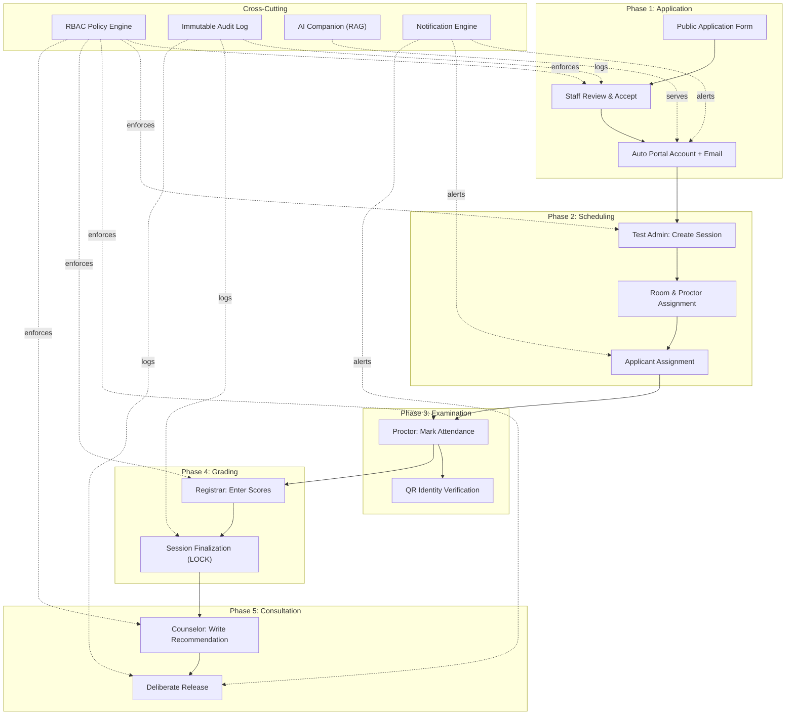
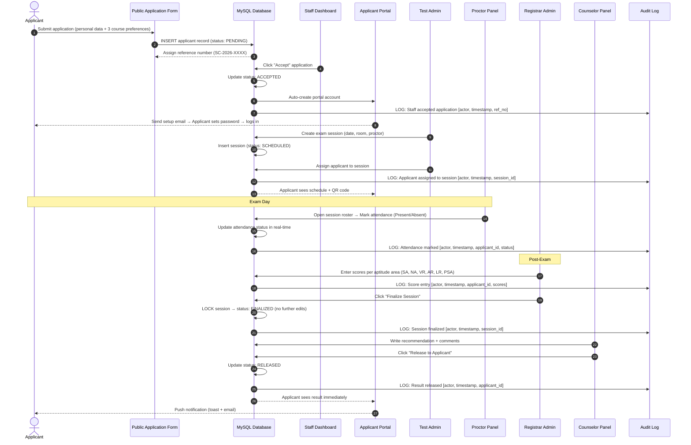

# **Title Defense Guide: SecureCAT**
*A Comprehensive Strategic Roadmap, System Architecture Deep-Dive, and Mock Q&A for the Capstone Title Defense*

---

## **1. Title Defense Alignment & Structural Overview**

### **The Core Shift**
Unlike generic student information systems or flat form-collectors, **SecureCAT** operates as a **Role-Gated Admission Testing Pipeline** grounded in Information Assurance and Security (IAS) principles. It solves the systemic failures of manual, paper-based college admission testing at ISPSC Tagudin — from disconnected applicant data, zero identity verification at exam doors, uncontrolled score modification, absent audit trails, and zero applicant support during the waiting period — by orchestrating the entire CAT lifecycle under strict role-based access control, state-guarded workflows, and immutable audit logging.

$$\text{SecureCAT} = \underbrace{\text{IAS-Grounded RBAC}}_{\text{4 Roles + Policy Gates}} + \underbrace{\text{State-Guarded Pipeline}}_{\text{Scheduled} \to \text{Active} \to \text{Completed} \to \text{Finalized}} + \underbrace{\text{Immutable Audit Trail}}_{\text{Non-Repudiation}} + \underbrace{\text{RAG AI Companion}}_{\text{Curated KB + No Hallucination}}$$

### **System Target Metrics**
*   **Application-to-Decision Turnaround**: $<48\text{h}$ from applicant submission to portal account provisioning after staff acceptance.
*   **Role Isolation Compliance**: $100\%$ — zero cross-role data leakage; proctors never see scores, applicants never see grading, registrars never modify schedules outside their gate.
*   **Session Finalization Integrity**: $0$ score modifications permitted after session finalization — enforced at the database constraint level.
*   **Audit Trail Completeness**: $100\%$ of state transitions (application accepted, session activated, scores entered, result released) are immutable logged entries with actor, timestamp, and payload.
*   **AI Companion Hallucination Rate**: $0\%$ — the chat widget answers exclusively from RAG-retrieved ISPSC knowledge base documents; no knowledge = no answer.

---

## **2. 6-Slide Defense Pacing (5-Minute Budget)**

### **Slide 1 — Title & Registry (15 Seconds)**
> **Slide 1: Title & Registry**
> *   **Visuals**: Glowing green **SC** shield logo, registry code `BSIT-CAP4-2026-SC-V2`, and project title.
> *   **Verbal Lead**: *"Good morning, members of the panel. I am David Datu Sarmiento, presenting **SecureCAT** — a Role-Based College Admission Testing System for the Guidance and Registrar Offices at ISPSC Tagudin. We address the systemic vulnerabilities of manual processes by implementing strict role-based access control, state-guarded workflows, and immutable audit logging."*
> *   **Pacing Goal**: Set a professional, security-focused tone and register the project code immediately.

### **Slide 2 — Context & The Problem (45 Seconds)**
> **Slide 2: Context & The Problem**
> *   **Visuals**: Split view — a warning console log showing Excel errors on the left, and the two vulnerability cards (Identity Gaps and Score Manipulation) on the right.
> *   **Verbal Lead**: *"Every year, hundreds of applicants go through the College Admission Test. The manual process relies on spreadsheets, check-ins verified by visual inspection, and scores entered without audit trails. As shown in the console log on the left, this easily leads to overwritten schedules and untraced score modifications. SecureCAT addresses these vulnerabilities directly through digital identity check-in, isolated role boundaries, and permanent audit trails."*
> *   **Pacing Goal**: Explain the real-world operational context and highlight the two critical vulnerability vectors.

### **Slide 3 — Proposed System & Component Map (45 Seconds)**
> **Slide 3: Proposed System & Component Map**
> *   **Visuals**: Horizontal 5-phase gated pipeline on top, and the five compliance cards (Web, Mobile, AI/ML, IoT, Mapping) at the bottom.
> *   **Verbal Lead**: *"We co-engineer security into the workflow using a 5-phase role-gated pipeline. The applicant applies, the admin schedules, the proctor checks them in, the registrar encodes scores, and the counselor releases results. No role can cross their policy gate. Our implementation maps to five capstone pillars: Laravel 12 and Svelte 5 for Web, responsive PWA for Mobile, RAG AI Companion for AI/ML, QR check-in for IoT, and Leaflet.js for Mapping."*
> *   **Pacing Goal**: Detail the five roles, their strict gating, and map the architecture to the five capstone curriculum components.

### **Slide 4 — Interactive Pipeline Simulation (Live Demo) (120 Seconds)**
> **Slide 4: Interactive Pipeline Simulation (Live Demo)**
> *   **Visuals**: Interactive multi-surface simulator showing the live transitions of the pipeline phases in response to user actions.
> *   **Verbal Lead**: *"Let us demonstrate the system's operational flow using this interactive simulator. First, the applicant registers and queries the RAG-based AI Companion. On exam day, the proctor scans their QR code, changing their status to 'Examining'. After testing, the registrar enters scores. When we click 'Finalize and Lock', the scores are database-locked. If an attacker tries to modify them, SQL write-once triggers block the write and log a threat alert. Finally, the counselor releases the scores to the applicant portal. This shows the exact screens running in our Laravel application."*
> *   **Pacing Goal**: Walk through the interactive simulator to prove state transitions, RBAC enforcement, database-level security locks, and RAG query responses.

### **Slide 5 — System Comparisons & Boundaries (45 Seconds)**
> **Slide 5: System Comparisons & Boundaries**
> *   **Visuals**: Left: Security comparison matrix (SecureCAT vs. Manual Process vs. Generic SIS). Right: In-Scope and Out-of-Scope boundaries list.
> *   **Verbal Lead**: *"SecureCAT replaces visual ID checks with low-risk QR checks, and vulnerable spreadsheets with database-locked scores. It ensures non-repudiation with SQL write-once triggers, and replaces high office overhead with the RAG AI Companion. To maintain feasibility, our scope covers the full administrative CAT lifecycle, while online exam delivery and payment processing are explicitly out of scope."*
> *   **Pacing Goal**: Establish the novelty of SecureCAT through a security comparison and define clear operational boundaries.

### **Slide 6 — Development Roadmap & Conclusion (30 Seconds)**
> **Slide 6: Development Roadmap & Conclusion**
> *   **Visuals**: Completed roadmap milestones, automated and manual testing gates, and final system metrics.
> *   **Verbal Lead**: *"All five development phases are completed. We verified system reliability through 48 automated PHPUnit test cases covering role access and state transitions, alongside manual user acceptance testing. In conclusion, the system achieves four distinct role silos, a 100% complete audit log, and a 0% hallucination rate, proving that institutional security and usability can be successfully co-engineered. Thank you, and we welcome your questions."*
> *   **Pacing Goal**: Present the completed timeline, testing gates (automated/manual), and conclude with the final target metrics.

---

## **3. System Architecture Deep-Dive**

### **Role-Gated Pipeline Topology**
This diagram shows how the four user roles interact with the five-phase admission pipeline, with RBAC enforcement at every boundary.

### **Applicant Lifecycle Sequence Flow**
This diagram tracks an applicant's journey from form submission through result release.

---

## **4. Key Technical Arguments**

1.  **Why role-based access control instead of simple login-based access?**
    A single authentication layer is insufficient when users with different responsibilities share the same system. Without RBAC, any logged-in user could access any function — a proctor could modify scores, an applicant could view other applicants' data. SecureCAT implements Laravel Policies and route-level Gates so that each of the four roles (Registrar Administrator, Test Administrator, Proctor, Applicant) sees only the routes and data their role permits. This is not a UI-level hide — it is server-enforced authorization. If a proctor attempts to hit the grading endpoint, the policy denies it with a 403 before any data is returned.

2.  **Why state-guarded workflows instead of free-form editing?**
    Free-form editing allows any state transition at any time — a session can skip from "Scheduled" to "Finalized" without ever going through "Active" or "Completed." This breaks audit integrity and allows premature score access. SecureCAT enforces a formal state machine: Scheduled → Active → Completed → Finalized. Each transition requires a specific actor action and checks the current state as a precondition. Sessions cannot skip states. Once finalized, a database-level constraint prevents further score modifications — not just a UI toggle, but a hard enforcement layer.

3.  **How does the immutable audit trail prevent data tampering?**
    Every critical action (application accepted, session finalized, scores entered, result released) writes to an append-only `audit_logs` table. These records include the actor ID, timestamp, action type, and affected entity. Unlike editable log tables, audit logs use database triggers that block `UPDATE` and `DELETE` operations, ensuring non-repudiation. If someone modifies a score before finalization, the audit trail still shows what changed, who changed it, and when.

4.  **How does the AI Companion avoid hallucinating information?**
    The AI Companion is not a generic chatbot with access to the internet. It uses Retrieval-Augmented Generation (RAG) — when an applicant asks a question, the system first retrieves relevant documents from a curated ISPSC-specific knowledge base (course descriptions, admission policies, exam procedures) using Mixedbread embeddings. Only the retrieved context is passed to the LLM (via OpenRouter) for answer generation. If no relevant documents are found, the assistant responds that it does not have that information — it never fabricates answers from its training data. The knowledge base is curated by the institution, not scraped from the web.

5.  **Why is result release deliberate instead of automatic?**
    Automatic release would expose scores and recommendations to applicants the moment grading is finalized — without counselor review. This is operationally dangerous: a counselor may need to flag anomalies, adjust recommendations based on holistic assessment, or coordinate with the registrar before the applicant sees their result. SecureCAT makes release a deliberate, two-step action: the counselor writes their recommendation, then explicitly clicks "Release." Only then does the result become visible in the applicant portal. The counselor controls the moment of disclosure.

---

## **5. Mock Q&A: 30 Anticipated Questions & Answers**

### **Category A: Architecture & IAS Principles**
#### **Q1. Why is the system called "Secure" CAT? What makes it secure compared to regular web apps?**
*   **Answer**: The "Secure" prefix reflects the IAS (Information Assurance and Security) foundation. Three structural properties distinguish SecureCAT from regular CRUD web apps: (1) Role-Based Access Control enforced at the policy and route level — not just UI hiding; (2) State-guarded workflows that prevent invalid state transitions; and (3) Immutable audit logging that provides non-repudiation for every critical action. These are not features bolted on — they are the architectural foundation.

#### **Q2. What specific IAS principles does the system implement?**
*   **Answer**: SecureCAT addresses five IAS pillars: **Confidentiality** — applicant data is visible only to roles with authorized access; applicants cannot see other applicants' data. **Integrity** — finalization locks prevent post-commit score modification; audit trails record every change. **Availability** — the system is a self-contained Laravel application with no external service dependencies for core functionality. **Accountability** — every action is logged with actor identity and timestamp. **Non-repudiation** — audit logs are append-only with no UPDATE/DELETE capability at the database level.

#### **Q3. How is RBAC technically implemented? Is it just middleware checks?**
*   **Answer**: RBAC is implemented at two enforcement layers. **Layer 1 — Route-level Gates** in `bootstrap/app.php` and route files restrict endpoint access by role (e.g., `Gate::allows('proctor-access')`). **Layer 2 — Laravel Policies** provide model-level authorization (e.g., `ApplicantPolicy::viewResult` checks that the requesting user is the applicant's own account or an authorized counselor). Both layers must pass for a request to succeed. Bypassing one layer does not bypass the other.

#### **Q4. Why use Laravel Policies instead of simple middleware role checks?**
*   **Answer**: Middleware role checks answer "Is this user a proctor?" — a broad, role-membership question. Laravel Policies answer "Is this specific proctor authorized to view this specific session's roster?" — a resource-level question. Policies receive both the authenticated user and the target model, enabling fine-grained authorization that middleware alone cannot provide. A proctor should see only their assigned session roster, not all session rosters campus-wide.

#### **Q5. What happens if an admin account is compromised?**
*   **Answer**: Even if an admin account is compromised, the audit trail records every action taken under that account with timestamps. The compromise is detectable and traceable. Additionally, session finalization is irreversible — even a compromised admin cannot unlock a finalized session. The damage surface is contained: they can perform admin-level actions, but every action is logged, and score integrity after finalization is protected.

---

### **Category B: Workflow & State Machine**
#### **Q6. Why enforce a state machine for exam sessions instead of letting admins manage sessions freely?**
*   **Answer**: Free-form management allows state skips — a session could go from "Scheduled" directly to "Finalized," bypassing the Active and Completed states. This means exams could be finalized without ever being conducted or proctored, which defeats the entire verification chain. The state machine enforces operational sequence: a session must pass through Active (exam day) and Completed (proctor closes session) before it can be Finalized (scores locked). Each transition is guarded.

#### **Q7. Can a finalized grading session be unlocked for corrections?**
*   **Answer**: No. By design, finalization is a one-way operation. Once the Registrar Administrator finalizes a grading session, a database constraint prevents any further score modification. If a legitimate correction is needed, the correct process is: (1) document the error in the audit trail, (2) create a new grading amendment record with the corrected score, (3) log the amendment with the authorizing administrator's identity. The original score is never overwritten — it remains in the audit trail alongside the amendment.

#### **Q8. What happens if a proctor forgets to mark attendance on exam day?**
*   **Answer**: The real-time attendance tracking is designed to be used during the exam. If a proctor fails to mark attendance for some applicants, those applicants simply remain in the "Not Marked" state. The system does not auto-mark anyone as present or absent — that decision belongs to the proctor. Unmarked applicants are flagged in the post-exam report for administrative follow-up.

#### **Q9. How do walk-in applications differ from online applications in the pipeline?**
*   **Answer**: Online applicants submit through the public form and receive a reference number immediately. Walk-in applicants are entered by staff through the same application management interface used for review. Both workflows converge at the same point: once accepted, the applicant receives a portal account. The pipeline after acceptance is identical regardless of how the application was submitted.

#### **Q10. How does the AI Scheduling Assistant work?**
*   **Answer**: The AI Scheduling Assistant provides context-aware support to Test Administrators. It knows current room capacities, existing examinee loads per session, and which accepted applicants remain unassigned. It can suggest optimal applicant-to-session assignments to balance loads and fill rooms efficiently. This is not a fully automated scheduler — the Test Administrator retains full control and makes the final assignment decisions.

---

### **Category C: Security & Privacy**
#### **Q11. How is the system compliant with the Data Privacy Act (RA 10173)?**
*   **Answer**: SecureCAT enforces data privacy through three mechanisms: (1) **Minimization** — the applicant portal only shows data relevant to the applicant's own record; there is no directory of other applicants. (2) **Role isolation** — proctors see attendance data, not scores; registrars see scores, not counseling notes; applicants see only their own results. (3) **Consent-based access** — applicants access their results only after explicit counselor release.

#### **Q12. How are applicant credentials secured?**
*   **Answer**: Applicant accounts are created only after application acceptance. Passwords are never stored in plaintext — Laravel's bcrypt hasher is used. The initial setup is handled through a one-time, time-limited setup link sent via email. There is no universal default password.

#### **Q13. What prevents CSRF attacks on the grading interface?**
*   **Answer**: All form submissions are protected by Laravel's built-in CSRF middleware. Every form includes a cryptographically signed CSRF token that is validated server-side before any state-changing operation is processed. API endpoints use bearer token authentication instead of session-based CSRF, but are similarly protected.

#### **Q14. How is data encrypted in transit and at rest?**
*   **Answer**: In transit — the application should be deployed behind HTTPS with TLS 1.2+, encrypting all data between client and server. At rest — MySQL supports tablespace encryption. Sensitive fields (like applicant contact information) can be encrypted at the application layer using Laravel's `encrypt()` helper, which uses AES-256-CBC.

#### **Q15. What measures prevent staff from manipulating applicant scores?**
*   **Answer**: Three layers prevent score manipulation: (1) **RBAC** — only Registrar Administrators can access the grading interface; proctors and staff cannot. (2) **Audit logging** — every score entry and modification is logged with the actor's identity and timestamp. (3) **Finalization lock** — once a session is finalized, no further modifications are possible at the database constraint level. Pre-finalization changes are still logged and auditable.

---

### **Category D: AI Companion & RAG**
#### **Q16. Why use RAG instead of a fine-tuned model for the AI Companion?**
*   **Answer**: Fine-tuning a model requires a large training dataset and retraining whenever institutional policies change. RAG is more practical: the knowledge base is a set of curated documents that can be updated instantly without retraining. When ISPSC updates a course description, the document is replaced in the vector store, and the AI Companion immediately answers from the new document. Fine-tuning would require collecting the change, retraining, and redeploying — a process that could take days.

#### **Q17. Why Mixedbread for embeddings specifically?**
*   **Answer**: Mixedbread provides high-quality embedding models optimized for retrieval tasks. The embeddings convert ISPSC policy documents into dense vector representations that capture semantic meaning — not just keyword matches. When an applicant asks "What does BSIT involve?", the retrieval layer finds the BSIT course description document even if the applicant's phrasing differs from the document's exact wording.

#### **Q18. How do you prevent the AI Companion from answering questions outside its domain?**
*   **Answer**: The RAG pipeline includes a retrieval confidence threshold. When a question is asked, the system retrieves documents from the ISPSC knowledge base. If the top retrieved documents have similarity scores below the threshold, the system responds that it does not have information on that topic rather than attempting to generate an answer from the LLM's general training data. This is the core anti-hallucination mechanism.

#### **Q19. Can the AI Companion be manipulated into revealing scores or other applicants' data?**
*   **Answer**: No. The AI Companion operates in the applicant portal context. Its knowledge base contains only publicly available information — course descriptions, admission procedures, exam schedules. It has no access to applicant records, scores, or personal data. Even if a user attempts prompt injection, the RAG retrieval layer scopes answers to the curated knowledge base documents only.

#### **Q20. What happens when multiple applicants ask the AI Companion the same question simultaneously?**
*   **Answer**: The AI Companion is stateless per-request — each question is processed independently through the RAG pipeline. Concurrent requests are handled by the underlying Laravel queue worker and OpenRouter API. There is no shared conversational state between applicants, so there is no cross-talk risk.

---

### **Category E: Implementation & Technology**
#### **Q21. Why Laravel 12 instead of a lighter framework like Express.js or Flask?**
*   **Answer**: Laravel 12 provides built-in solutions for every IAS requirement out of the box: Policies for RBAC, Gates for route-level authorization, native audit logging via model events, queue workers for email notifications, and Eloquent ORM with migration-based schema management. Implementing equivalent infrastructure in Express.js or Flask would require assembling dozens of separate packages with no unified convention, increasing integration risk and development overhead.

#### **Q22. Why Svelte 5 with Inertia.js v2 instead of a separate React SPA?**
*   **Answer**: A separate React SPA requires a fully independent API layer, token-based authentication, and state synchronization between client and server. Inertia.js eliminates this by allowing Laravel to render Svelte components directly through server-side routing — no separate API, no client-side router, no token management. The server remains the source of truth for authorization, and the frontend is a thin rendering layer. This reduces the attack surface: there is no public API to exploit.

#### **Q23. How does the QR code identity verification work technically?**
*   **Answer**: When an applicant is assigned to an exam session, the system generates a unique QR code containing their applicant ID and session assignment, signed with an application-level HMAC. On exam day, the proctor scans the QR code using the browser's camera API. The system validates the HMAC signature and matches the scanned identity against the session roster before marking the applicant present. The QR code is session-specific and time-scoped — it cannot be reused for a different session.

#### **Q24. How are notifications implemented?**
*   **Answer**: Notifications use Laravel's native notification system with two channels: **Email** (SMTP) for application acceptance, schedule assignment, and result release; **In-app** (database + broadcast) for toast notifications with a two-tier sound system — a chime for informational updates and an alert tone for urgent events. Notifications are queued via Laravel Queue workers to avoid blocking the HTTP response cycle.

#### **Q25. How is the demo dataset structured for the defense presentation?**
*   **Answer**: The demo dataset includes pre-seeded applicants at various pipeline stages: some pending, some accepted with portal accounts, some assigned to sessions, some with finalized scores, and some with released results. This allows the live demo to walk through the complete lifecycle without needing real-time data entry for every step. The seed data is documented and versioned alongside the migrations.

---

### **Category F: General Capstone Alignment**
#### **Q26. Why is this project suited for a BSIT capstone?**
*   **Answer**: The project spans five curriculum pillars. Web — Laravel/Svelte full-stack development. Mobile — responsive applicant portal accessible on any device. ML/AI — RAG-grounded AI Companion with vector embeddings and LLM routing. IoT — QR-based identity verification at exam entry points. Mapping — Leaflet.js campus venue visualization. The IAS grounding adds a security dimension that elevates the project above typical CRUD applications.

#### **Q27. How does the system help the Guidance and Registrar Offices specifically?**
*   **Answer**: The Guidance and Registrar Offices benefits in three ways: (1) Real-time proctoring replaces paper-based attendance, eliminating manual roster management. (2) The AI Companion handles repetitive applicant queries, freeing staff time for higher-value counseling work. (3) Deliberate result release gives counselors full control over when applicants see their results, preventing premature disclosure and enabling proper counseling before release.

#### **Q28. What happens if the system goes down on exam day?**
*   **Answer**: SecureCAT is a self-contained Laravel application with no external service dependencies for core functionality. The database, application server, and all core features run locally. The AI Companion and email notifications depend on external services (OpenRouter, SMTP), but these are non-critical — the exam can proceed with proctoring and attendance even if the AI Companion or email service is temporarily unavailable.

#### **Q29. How do you gather data for institutional reporting?**
*   **Answer**: The audit logs serve a dual purpose: compliance and analytics. The system provides dashboards with application counts, session participation rates, score distributions, and counselor recommendation summaries. These can be exported for institutional reporting. The append-only nature of the audit logs means historical data is always intact and verifiable.

#### **Q30. How does the system handle applicants who miss their scheduled exam?**
*   **Answer**: If an applicant does not attend their scheduled exam, the proctor marks them as "Absent" in the real-time roster. The system records this status. The applicant's record reflects the absence. If the institution allows rescheduling, the Test Administrator can assign the applicant to a new session — the applicant receives a new schedule and QR code through the portal. The audit trail logs both the absence and the rescheduling.
